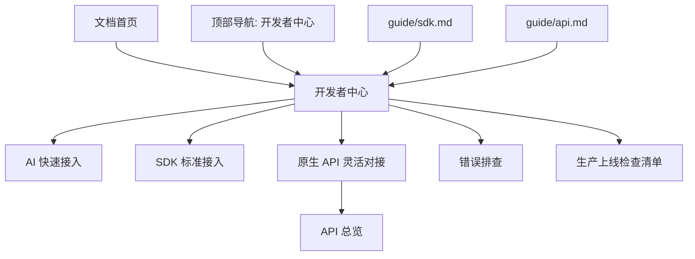
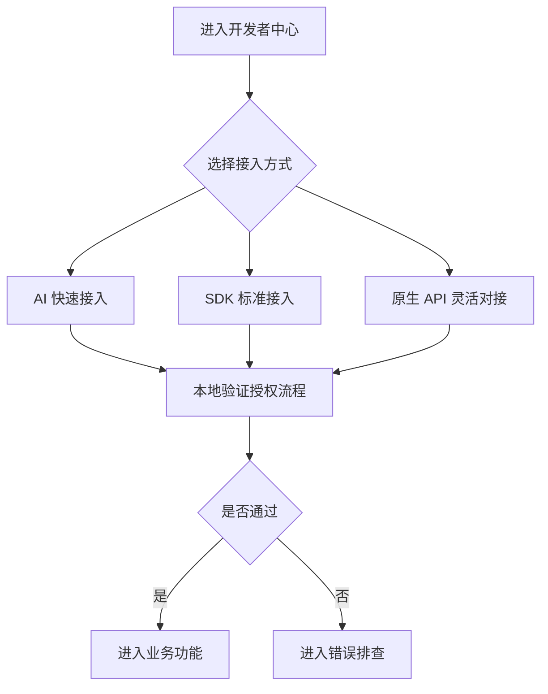

# 开发者接入中心设计

## 方案概述

本次建设采用“文档型开发者接入中心”方案，在现有 VitePress 文档站中新增一级导航“开发者中心”，并新增 `docs/developer/` 中文文档目录。

第一阶段只交付中文主路径，不开发 SaaS 后台动态工作台，不修改服务端接口和 SDK 代码。目标是把现有分散的 SDK、API、许可证结构、操作指南等资料，重组为开发者可按任务完成接入的路径。

第一阶段重点页面：

| 页面 | 目标 |
|------|------|
| 开发者中心首页 | 作为开发者接入统一入口，给出推荐路径 |
| AI 快速接入 | 告诉用户把哪些文档链接和项目代码交给 AI 完成接入改造 |
| SDK 标准接入 | 帮助用户优先使用 SDK 接入，减少底层接口和验签工作 |
| 原生 API 灵活对接 | 帮助高级用户按接口完成完全自定义接入 |
| 在线激活 | 说明有网络环境下的首次激活、本地保存和后续校验 |
| 离线激活 | 说明无网络环境下的请求、签发、导入和本地校验 |
| C# SDK | 作为第一阶段标杆 SDK 文档 |
| 错误排查 | 按问题现象定位激活和校验失败原因 |
| 生产上线检查清单 | 帮助客户正式上线前自检 |

现有 `guide/sdk.md` 和 `guide/api.md` 保留，但改为引导读者进入开发者中心，避免继续作为主要接入入口。

## 数据模型变更

本阶段无数据库或业务数据模型变更。

文档层面的信息结构变更如下：

| 类型 | 变更 |
|------|------|
| 文档目录 | 新增 `docs/developer/` |
| 导航结构 | 中文站点一级导航新增“开发者中心” |
| 侧边栏结构 | 新增 `/developer/` 专属侧边栏 |
| 现有文档关系 | `guide/sdk.md`、`guide/api.md`、首页相关入口增加到开发者中心的跳转 |
| 英文文档 | 第一阶段不新增英文页面，仅在设计上预留后续对应路径 |

## 接口设计

本阶段不新增、修改或删除后端接口。

文档中的 API 说明采用“任务入口 + Swagger 详情”的方式：

| 文档页面 | API 说明范围 |
|----------|--------------|
| `developer/activation-online.md` | 说明在线激活涉及的输入、输出和错误处理，不替代完整 Swagger |
| `developer/activation-offline.md` | 说明离线激活涉及的业务过程和数据流 |
| `developer/api/index.md` | 作为开发者 API 入口，连接到 Swagger 和任务型文档 |
| `developer/api/activation.md` | 按开发者接入视角说明激活相关接口 |
| `developer/api/errors.md` | 说明常见错误码、错误现象和排查方式 |

API 文档写作规则：

1. 只描述开发者接入需要理解的关键字段。
2. 完整字段和实时接口以 Swagger 为准。
3. 不新增服务端响应字段，不改变现有接口语义。
4. 对未确认字段使用“待确认”标记，不写成事实。

## 核心逻辑流程

### 1. 站点导航流程



设计要点：

- “开发者中心”作为中文站点一级导航展示。
- 首页保留原有产品入口，但增加开发者中心快捷入口。
- `guide/sdk.md` 保留 SDK 仓库索引属性，同时推荐进入 C# 标杆接入文档。
- `guide/api.md` 保留 Swagger 入口属性，同时推荐进入开发者 API 说明。

### 2. 首次接入流程



设计要点：

- AI 快速接入页说明用户应提供给 AI 的文档链接和项目上下文。
- SDK 标准接入页承载官方 SDK 的推荐路径。
- 原生 API 灵活对接页承载接口级接入流程。
- 在线激活页说明首次激活和后续本地校验的区别。
- 离线激活页说明无网络环境下的交付流程。
- 错误排查页作为所有失败路径的统一出口。

### 3. C# SDK 文档结构

C# SDK 页面作为第一阶段标杆文档，建议结构如下：

```text
# C# SDK 接入

## 适用场景
## 前置要求
## 安装 SDK
## 准备接入配置
## 首次在线激活
## 本地许可证校验
## 读取业务授权配置
## 常见错误
## 下一步
```

其中“读取业务授权配置”需要突出：

- `feature_config`：功能开关
- `usage_limits`：使用额度
- `custom_parameters`：业务自定义参数
- `status`、`start_date`、`end_date`：授权状态和有效期

当前 C# SDK 已确认使用 `https://github.com/cedar-v/license-manager-dotnet.git`，包名为 `LicenseManager.DotNet`，文档实现时应以该仓库 README、AI-README 和公开源码为准。

## 新增/修改文件清单

### 新增文件

| 文件 | 说明 |
|------|------|
| `docs/developer/index.md` | 开发者中心首页 |
| `docs/developer/ai-quickstart.md` | AI 快速接入 |
| `docs/developer/quickstart.md` | 原生 API 灵活对接 |
| `docs/developer/activation-online.md` | 在线激活接入说明 |
| `docs/developer/activation-offline.md` | 离线激活接入说明 |
| `docs/developer/license-validation.md` | 本地许可证验签与运行时校验 |
| `docs/developer/hardware-fingerprint.md` | 硬件指纹策略说明 |
| `docs/developer/sdk/index.md` | SDK 接入总览 |
| `docs/developer/sdk/csharp.md` | C# SDK 标杆接入文档 |
| `docs/developer/api/index.md` | 开发者 API 入口 |
| `docs/developer/api/activation.md` | 激活相关接口说明 |
| `docs/developer/api/errors.md` | 错误码与接口错误说明 |
| `docs/developer/troubleshooting.md` | 常见问题排查 |
| `docs/developer/production-checklist.md` | 生产上线检查清单 |

### 修改文件

| 文件 | 说明 |
|------|------|
| `docs/.vitepress/config.mjs` | 中文导航新增“开发者中心”，新增 `/developer/` 侧边栏 |
| `docs/index.md` | 首页增加开发者中心入口 |
| `docs/guide/sdk.md` | 从 SDK 索引页补充到开发者中心和 C# 标杆文档的跳转 |
| `docs/guide/api.md` | 从 Swagger 入口页补充到开发者 API 文档的跳转 |
| `docs/guide/license-token-structure.md` | 补充返回开发者中心相关页面的链接 |
| `docs/guide/operating_guide.md` | 在接入相关章节补充开发者中心入口 |

### 暂不修改

| 文件或目录 | 原因 |
|------------|------|
| `docs/en/` | 第一阶段只做中文文档 |
| 后端服务代码 | 本阶段无接口和业务逻辑变更 |
| SDK 代码仓库 | 本阶段只建设文档，不修改 SDK |
| 客户端模拟器导航 | 已确认第一阶段不纳入开发者中心导航 |

## 文档路径与导航设计

### 中文导航

`docs/.vitepress/config.mjs` 中文 `nav` 增加：

```js
{ text: '开发者中心', link: '/developer/' }
```

建议顺序：

```text
首页 / 指南 / 开发者中心 / 战略洞察 / 客户案例 / 政策与规范
```

### 中文侧边栏

新增 `/developer/` sidebar：

```text
开发者中心
- 概览
- AI 快速接入
- 原生 API 灵活对接
- 在线激活
- 离线激活
- 本地许可证校验
- 硬件指纹策略

SDK 接入
- SDK 总览
- C# SDK 接入

API 与排障
- API 总览
- 激活接口
- 错误码
- 常见问题排查
- 生产上线检查清单
```

### 示例占位值规范

第一阶段文档统一使用雪松授权云平台占位值：

| 类型 | 占位值 |
|------|--------|
| 平台地址 | `https://lic.cedar-v.com/` |
| API 地址 | `https://lic.cedar-v.com` |
| 应用标识 | `demo-app` |
| 授权码 | `LIC-DEMO-XXXX-XXXX` |
| API Key | `sk_demo_xxxxxxxxxxxxxxxx` |
| 许可证文件 | `license.dat` |
| 公钥文件 | `public_key.pem` |

占位值规则：

1. 不使用真实生产密钥。
2. 不使用真实客户数据。
3. 所有示例保持一致，避免不同页面出现多个示例环境。
4. 涉及私钥时只说明“由平台保存”，不提供私钥示例。

## 页面内容设计

### `developer/index.md`

目标：帮助用户选择接入路径。

内容结构：

1. 开发者中心定位
2. 推荐接入路径
3. 在线/离线/混合模式选择
4. SDK 与 HTTP API 选择
5. 常用入口卡片
6. 上线前检查入口

### `developer/quickstart.md`

目标：首次接入最短闭环。

内容结构：

1. 前置要求
2. 第一步：准备雪松授权云平台信息
3. 第二步：准备测试授权码
4. 第三步：选择 C# SDK 或 HTTP API
5. 第四步：完成首次激活
6. 第五步：本地校验许可证
7. 第六步：处理常见失败
8. 后续阅读

### `developer/activation-online.md`

目标：说明在线激活完整流程。

内容结构：

1. 适用场景
2. 在线激活时序
3. 客户端需要提交的信息
4. 服务端返回的信息
5. 客户端需要保存的信息
6. 后续启动如何校验
7. 常见失败场景

### `developer/activation-offline.md`

目标：说明离线授权交付流程。

内容结构：

1. 适用场景
2. 离线激活时序
3. 离线机器生成请求
4. 有网环境完成签发
5. 离线机器导入许可证
6. 离线场景限制
7. 常见失败场景

### `developer/troubleshooting.md`

目标：降低售后和交付排查成本。

每个问题使用固定结构：

```text
现象
可能原因
如何确认
解决方法
相关文档
```

第一阶段覆盖：

- 授权码不存在
- 授权码已过期
- 授权码被锁定
- 激活次数已满
- 设备指纹不一致
- 签名验证失败
- 许可证文件损坏
- 客户端时间异常
- 网络不可达
- API Key 无效

### `developer/production-checklist.md`

目标：正式上线前自检。

检查维度：

- 授权模式
- 硬件指纹策略
- 有效期策略
- 测试授权
- 生产授权
- 许可证保存位置
- 公钥保存位置
- 错误提示
- 日志记录
- 离线兜底
- 客户支持资料
- 发布前验证

## 影响范围与风险

### 影响范围

| 范围 | 影响 |
|------|------|
| 中文文档导航 | 新增一级导航和侧边栏，影响站点信息架构 |
| 首页入口 | 增加开发者中心入口，提升接入路径可见性 |
| SDK/API 文档 | 从单页索引调整为开发者中心入口的一部分 |
| 站内搜索 | 新增页面会进入本地搜索索引 |
| 英文文档 | 第一阶段不变，短期中英文结构不完全一致 |

### 主要风险

| 风险 | 说明 | 应对 |
|------|------|------|
| C# SDK 发布渠道变化 | SDK 仓库已确认，但 NuGet 发布源可能随交付方式调整 | 文档保留源码打包和 NuGet 安装两种路径，后续以实际发布渠道同步更新 |
| 文档与实际接口不一致 | 接入文档如果脱离 Swagger 或后端实际行为，会误导客户 | API 字段以 Swagger 和现有许可证结构文档为准 |
| 导航过重 | 一级导航新增后，用户可能在指南与开发者中心之间困惑 | 指南保留产品使用文档，开发者中心聚焦接入任务 |
| 内容重复 | SDK、API、许可证结构可能重复描述同一概念 | 用交叉链接复用已有文档，避免复制大段内容 |
| 英文滞后 | 第一阶段只做中文，英文用户暂时无法使用新路径 | 预留英文目录结构，后续按中文稳定版本同步 |
| 示例被误用为生产配置 | 演示授权码或 API Key 可能被误解为真实凭证 | 统一使用明显的 `demo` 占位值，并注明不可用于生产 |

## 验证方式

设计落地后的验证方式：

1. 执行 `npm run docs:build`，确认 VitePress 构建通过。
2. 本地运行 `npm run docs:dev`，检查 `/developer/` 及子页面可访问。
3. 检查中文顶部导航出现“开发者中心”。
4. 检查 `/developer/` 侧边栏结构与设计一致。
5. 检查首页、`guide/sdk.md`、`guide/api.md` 能跳转到开发者中心。
6. 检查页面内链接没有明显死链。
7. 搜索“C# SDK”“在线激活”“离线激活”“错误排查”，确认能检索到新增页面。

## 实施顺序

1. 新增 `docs/developer/` 基础目录和 P0 页面。
2. 修改 `config.mjs`，增加一级导航和 `/developer/` 侧边栏。
3. 修改首页、SDK 页、API 页的入口链接。
4. 补充 P1 页面：离线激活、本地许可证校验、硬件指纹、上线检查。
5. 执行构建验证并修复链接问题。
6. C# SDK 页面已按真实仓库信息回填；后续仅需随 SDK 发布版本同步更新。
