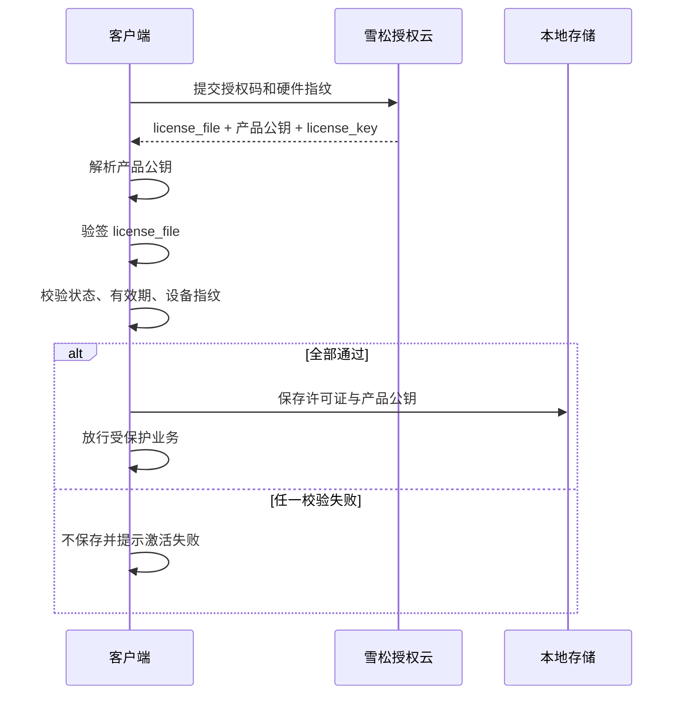
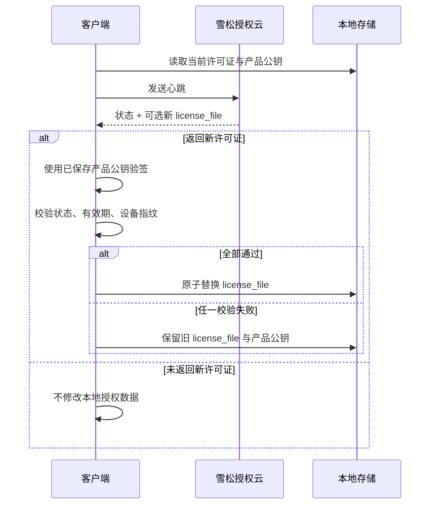
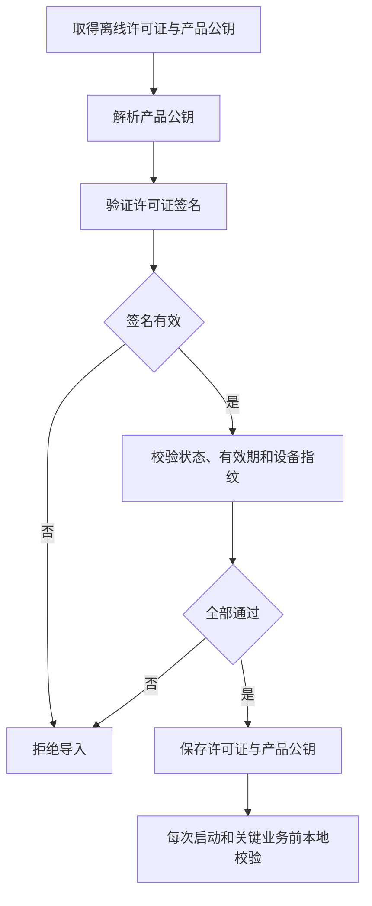

# GEO-01 客户端接入事实源设计

## 方案概述

本设计用于落实《雪松授权云官方站群 GEO 优化计划》中的 GEO-01，将公钥获取、许可证验签和许可证更新规则统一为一套可验证的官方说明。

本次不重新设计在线、首次联网、心跳、混合和纯离线模式。现有业务接入指导、操作指南和 AI 业务模板已经覆盖这些边界，本次只把公钥来源和许可证校验规则映射到各模式，并消除错误或重复表达。

### 已确认规则

1. 公钥是产品级公钥。
2. 首次在线激活不要求客户端预先内置公钥。
3. 激活接口返回 `license_file` 和 `public_key`。
4. 客户端使用同次响应中的产品公钥验证许可证；完整校验通过后，保存许可证和产品公钥。
5. 心跳可能返回新的 `license_file`，但不返回新的公钥。
6. 心跳新许可证继续使用首次激活取得并保存的产品公钥验签。
7. 心跳新许可证执行与激活许可证一致的签名、状态、有效期和设备指纹校验；全部通过后才替换本地许可证。
8. 在线试用和按设备指纹恢复如果同时返回许可证和产品公钥，处理方式与首次在线激活一致。
9. 纯离线环境不能通过在线接口取得公钥，因此许可证文件和产品公钥必须作为同一交付批次导入或随离线客户端部署。
10. SDK 可以提供固定公钥或公钥钉扎作为可选高级能力，但不得将其描述为首次在线激活的必要条件。

### 权威页面

`docs/guide/license-token-structure.md` 作为公钥信任模型、许可证结构和完整校验顺序的唯一权威页面。

其他页面按自身任务只保留必要摘要：

- 在线激活页面说明第一次如何获得并保存许可证和公钥。
- 心跳相关页面说明如何使用已保存的产品公钥验证新许可证。
- 纯离线页面说明如何成对导入许可证和产品公钥。
- SDK 页面说明 SDK 自动完成哪些步骤以及可选公钥钉扎能力。
- API 页面只说明响应字段和调用方责任，不重复完整安全原理。
- 排障页面只说明如何确认和修复公钥错配、丢失或验签失败。

### 内容去重策略

本次实施同时治理重复说明，文件命中不等于每个页面都继续保留一套完整规则：

1. `docs/guide/license-token-structure.md` 保留唯一完整解释。
2. `docs/developer/ai-quickstart.md` 因提示词需要脱离网站独立复制，保留一份自包含协议，属于必要重复。
3. 在线激活、离线激活和本地校验页面只保留各自场景的操作步骤，并链接权威页面。
4. API 页面只描述字段、返回条件和调用方责任，不重复安全原理。
5. SDK 页面只描述对应 SDK 的真实自动处理与配置边界，不重复原生 API 教程。
6. 业务指导只负责模式选择，排障和错误码页面只负责问题定位。
7. 首页、功能页和官网只保留准确的一句话产品表述。
8. 案例页和普通入口页如果没有相反事实，不因关键词命中而修改。

因此，原文件清单是冲突排查上限，不是要求在 22 个文档中重复新增内容。实施时优先删除重复段落或改为权威链接，同时必须修掉所有仍公开存在的相反结论。

## 数据模型变更

无数据库和服务端数据模型变更。

文档中的客户端本地持久化概念统一为：

| 本地数据 | 来源 | 更新规则 |
|----------|------|----------|
| `license_file` | 激活、试用、恢复、心跳或离线交付 | 完整校验通过后保存或替换 |
| 产品公钥 | 激活、试用、恢复响应或离线交付 | 在线首次获取时与许可证一起保存；心跳不更新 |
| `license_key` | 激活、试用或恢复响应 | 用于后续心跳和服务端查询 |
| `heartbeat_interval` | 在线接口响应 | 按服务端响应安排心跳，不在客户端写死 |

“许可证与产品公钥配对保存”表示客户端必须保证启动时能够取得用于验证当前许可证的产品公钥。具体采用单文件包、同目录双文件或版本目录，由 SDK 或对接项目决定，文档不强制统一存储实现。

## 接口设计

本次不新增、不修改和不删除服务端接口，也不改变现有响应结构。

### 在线激活

客户端使用：

```text
POST /api/v1/activate
```

关键成功响应：

```json
{
  "license_key": "许可证密钥",
  "license_file": "Base64 许可证",
  "heartbeat_interval": 300,
  "public_key": "产品级 RSA 公钥 PEM"
}
```

文档必须明确：

- 首次在线激活前不要求已有公钥。
- 客户端不得在未验签的情况下直接信任或保存许可证内容。
- 客户端先用响应中的 `public_key` 验证同次响应中的 `license_file`。
- 完整校验成功后，再保存许可证、公钥和后续在线流程需要的数据。

### 在线试用与按指纹恢复

当接口响应同时包含 `license_file` 和 `public_key` 时，采用与在线激活相同的处理规则：

1. 解析产品公钥。
2. 验证许可证签名。
3. 校验状态、有效期和设备指纹。
4. 全部通过后保存许可证和产品公钥。

文档不再把这些接口返回的 `public_key` 描述为“兼容字段”或“无需处理”。

### 心跳

客户端使用：

```text
POST /api/v1/heartbeat
```

关键成功响应：

```json
{
  "status": "active",
  "config_updated": true,
  "license_file": "Base64 新许可证",
  "heartbeat_interval": 300
}
```

文档必须明确：

- 心跳响应不返回新公钥。
- 没有新 `license_file` 时，不修改本地许可证和产品公钥。
- 有新 `license_file` 时，使用激活时保存的产品公钥进行验签。
- 验签、状态、时间和指纹校验均通过后，只替换许可证文件。
- 新许可证校验失败时保留旧许可证，不能破坏当前可恢复状态。

### 纯离线交付

纯离线场景不调用激活、试用、恢复和心跳接口。

离线交付物至少包括：

- `license_file`
- 与该产品对应的产品公钥

离线导入时先校验二者是否匹配，再校验许可证状态、有效期和设备指纹。全部通过后保存。文档不要求必须在应用编译阶段内置公钥，但允许对明确需要固定信任根的产品采用预置或钉扎方案。

## 核心逻辑流程

### 首次在线激活



### 心跳更新许可证



### 纯离线导入



## 页面内容分层

### 完整权威说明

| 页面 | 设计要求 |
|------|----------|
| `docs/guide/license-token-structure.md` | 完整说明产品级公钥、在线获取、离线交付、许可证结构、验签顺序、保存规则和心跳更新规则；增加生效日期、适用版本和变更说明 |

### 开发者主路径

| 页面 | 主要修改 |
|------|----------|
| `docs/developer/ai-quickstart.md` | 删除在线模板必须填写 `PRODUCT_PUBLIC_KEY_PEM` 的要求；协议改为使用激活、试用或恢复响应中的公钥；模板 A/B/C 保存响应公钥；模板 C 心跳复用已保存公钥；模板 D 改为导入许可证与产品公钥 |
| `docs/developer/activation-online.md` | 删除“发布前必须取得并内置公钥”；流程改为激活返回后先验签再保存许可证与公钥 |
| `docs/developer/activation-offline.md` | 从“发布前必须内置公钥”调整为“离线交付时提供许可证和产品公钥”；可选预置或钉扎不作为默认要求 |
| `docs/developer/quickstart.md` | 准备清单移除在线接入必备公钥；激活步骤改为处理响应公钥；链接到权威页面 |
| `docs/developer/license-validation.md` | 说明本地校验使用已保存或离线交付的产品公钥；删除“响应公钥无需处理” |
| `docs/developer/business-guidance.md` | 保留现有模式选择；只修正各模式下公钥的取得方式和权威页面链接 |

### API、SDK 与支持页面

| 页面 | 主要修改 |
|------|----------|
| `docs/developer/api/index.md` | 将 `public_key` 定义为当前许可证对应的产品公钥；在线响应要求配对验签与保存；心跳说明复用已保存公钥 |
| `docs/developer/api/activation.md` | 删除“兼容字段、无需处理”；说明首次在线激活使用响应公钥 |
| `docs/developer/api/errors.md` | 增加或修正公钥缺失、公钥格式错误、公钥与许可证不匹配的确认方式 |
| `docs/developer/sdk/index.md` | 说明 SDK 自动缓存激活响应公钥；固定公钥只作为可选能力 |
| `docs/developer/sdk/csharp.md` | 示例移除在线首次激活必填公钥；说明 SDK 自动保存响应公钥，心跳复用缓存公钥；离线模式单独说明公钥要求 |
| `docs/developer/troubleshooting.md` | 将排障对象从“程序内置公钥”改为“当前产品公钥缓存或离线交付公钥”；区分首次激活、心跳和离线导入 |
| `docs/developer/production-checklist.md` | 检查首次在线激活能否安全保存响应公钥；检查心跳更新失败不破坏旧许可证；检查离线交付物包含产品公钥 |
| `docs/developer/index.md` | 调整首次在线接入准备项，并把完整公钥规则指向权威页面 |

### 产品指南、案例与官网

| 页面 | 主要修改 |
|------|----------|
| `docs/index.md` | 将“一许可证一对密钥”改为准确的产品级签名和客户端本地验签表达 |
| `docs/guide/features.md` | 删除“一许可证一对密钥”的现行产品能力说明，改为产品级密钥和许可证独立授权数据 |
| `docs/guide/index.md` | 保留现有模式边界，只补充不同模式下产品公钥来源的简短链接 |
| `docs/guide/sdk.md` | 删除固定内置公钥作为新项目默认路径的描述；区分在线自动获取与可选公钥钉扎 |
| `docs/guide/cases/indie-developer-monetization.md` | 如保留 SDK 示例，确保首次在线激活不要求预置公钥，并使用有效 API 地址 |
| `docs/guide/cases/machine-vision-licensing.md` | 核对离线侧载描述，确保许可证与产品公钥同时交付并先验签后保存 |
| `products/cedar-license-cloud/index.html` | 将“一许可证一对密钥设计”调整为“产品级签名公钥与客户端本地验签”等准确、不过度展开的产品表述 |

官网文件位于：

```text
C:\B-work\thingspanel-work\0-m\Kimi_Agent_授权管理官网设计\cedar-website\products\cedar-license-cloud\index.html
```

### 英文关键页面

| 页面 | 设计要求 |
|------|----------|
| `docs/en/guide/license-token-structure.md` | 同步产品级公钥、首次在线获取、心跳复用和纯离线交付规则，避免英文公开页面继续传播旧规则 |

本次不要求完整重写全部英文开发者中心，但凡公开英文页面中出现相反公钥规则，必须同步纠正或暂时移除错误段落。

## 新增与修改文件清单

### 新增文件

| 文件 | 说明 |
|------|------|
| `.ai/02-设计/20260818-GEO01客户端接入事实源设计.md` | 本详细设计 |
| `.ai/03-交付/20260818-GEO01客户端接入事实源交付.md` | 完成实现和验证后新增，不在设计阶段创建 |

### 修改文件

优先修改以下 P0 页面：

1. `docs/guide/license-token-structure.md`
2. `docs/developer/ai-quickstart.md`
3. `docs/developer/activation-online.md`
4. `docs/developer/activation-offline.md`
5. `docs/developer/quickstart.md`
6. `docs/developer/license-validation.md`
7. `docs/developer/api/index.md`
8. `docs/developer/api/activation.md`
9. `docs/developer/sdk/index.md`
10. `docs/developer/sdk/csharp.md`
11. `docs/developer/troubleshooting.md`
12. `docs/developer/production-checklist.md`

随后只修改确有冲突的关联入口、产品说明和公开旧内容：

13. `docs/developer/business-guidance.md`
14. `docs/developer/api/errors.md`
15. `docs/developer/index.md`
16. `docs/index.md`
17. `docs/guide/features.md`
18. `docs/guide/sdk.md`
19. `docs/en/guide/license-token-structure.md`
20. 官网 `products/cedar-license-cloud/index.html`

`docs/guide/index.md` 与两个案例页当前只自然提及公钥或接入入口，没有表达相反信任规则，本次不修改。实际开发时继续以全文检索为准，没有相关冲突的页面不做无关改写。

### 不修改文件

1. License Manager 服务端代码和接口模型。
2. C#、C++、Go、Python SDK 代码。
3. 历史交付文档 `.ai/03-交付/20260805-产品公钥内置对接文档更新交付.md`。

历史交付文档作为当时决策记录保留。新的 GEO-01 交付文档需要明确说明其规则已被本次交付替代。

## 实施顺序

1. 先改写中文权威页面，固定完整规则和术语。
2. 修改 AI 原生协议和 A/B/C/D 模板。
3. 修改在线、离线、快速接入和本地校验主路径。
4. 修改 API、SDK、排障和上线检查页面。
5. 修改产品指南、案例和官网简要表述。
6. 同步英文关键页面。
7. 全文检索旧规则和冲突关键词。
8. 构建文档站并检查生成 HTML。
9. 形成交付文档并更新项目全局信息索引。

## 验证方案

### 内容一致性检查

全文检查以下错误现行规则已清除：

- 首次在线激活“必须内置公钥”。
- 激活、试用和恢复响应中的 `public_key` “无需处理”或“直接忽略”。
- 心跳新许可证需要等待或获取另一把公钥。
- 一许可证一对密钥作为当前默认产品签名模型。
- 纯离线只导入许可证、不提供对应产品公钥。

允许保留的例外：

- SDK 可选公钥钉扎说明。
- 纯离线或明确固定信任根场景的预置公钥说明。
- 历史交付文档中的旧规则，但新交付文档必须声明已替代。

### 构建检查

```powershell
npm run docs:build
```

验收：

- VitePress 构建成功。
- Mermaid 图表可以正常渲染。
- 新增和修改的站内链接没有死链。
- 生成 HTML 中包含更新后的公钥和验签说明。

### 行为对照检查

1. 对照当前激活成功响应，确认文档包含许可证和产品公钥。
2. 对照心跳成功响应，确认文档没有要求读取新公钥。
3. 对照 C# SDK，确认首次激活可以接收、缓存并使用响应公钥。
4. 对照 C++ SDK，确认首次在线激活可不预置公钥，心跳更新复用当前验证器公钥。
5. 对照纯离线交付能力，确认许可证与产品公钥可以共同交付。

本次只验证公钥与许可证处理，不盘点或统一各 SDK 的硬件指纹默认字段。

## 影响范围

### 正向影响

- 新用户首次在线激活不再被错误的预置公钥步骤阻塞。
- AI 接入提示词与真实 API、SDK 行为一致。
- 心跳更新规则有唯一解释，减少新许可证替换失败或错误放行。
- 纯离线交付的公钥来源更加清晰。
- 搜索和 AI 系统能够引用稳定的官方规则。

### 不受影响

- 服务端接口路径、请求字段和响应字段不变。
- 许可证签名算法和载荷结构不变。
- SDK 代码和对外 API 不变。
- 在线、混合、离线模式的业务边界不变。
- 硬件指纹算法和 SDK 默认字段不变。

## 风险与控制措施

| 风险 | 影响 | 控制措施 |
|------|------|----------|
| 只修改 AI 页面，其他旧页面继续冲突 | 用户和 AI 仍可能读取错误规则 | 按文件清单全量检索并分层修改 |
| 把在线规则错误套用到纯离线 | 离线客户端没有可用公钥 | 纯离线明确要求随许可证交付产品公钥 |
| 把可选公钥钉扎删除 | 高安全产品失去可选说明 | 保留为高级选项，但不作为在线首次激活前提 |
| 心跳新许可证校验失败时覆盖旧文件 | 客户端失去可恢复授权 | 明确先验证、后原子替换，失败保留旧文件 |
| 修改历史交付文档 | 丢失决策演变记录 | 不改历史文件，用新交付文档声明替代关系 |
| 英文页面继续传播旧规则 | 英文搜索结果与中文冲突 | 至少同步英文许可证结构关键页面 |
| 顺手改动 SDK 指纹规则或模式定义 | 扩大范围并引入新争议 | 明确排除，发现问题另建任务 |

## 设计确认点

1. `docs/guide/license-token-structure.md` 作为唯一完整权威页面，其他页面只保留任务所需摘要。
2. 在线激活、在线试用和按指纹恢复均信任同次 HTTPS 响应中的产品公钥与许可证组合。
3. 心跳不更新公钥，只用已保存产品公钥校验新许可证。
4. 纯离线默认随许可证交付产品公钥；预置或钉扎为可选方案。
5. GEO-01 同步修改官网“一许可证一对密钥”的产品表述。
6. 本次不修改 SDK 代码、不盘点 SDK 指纹字段、不重新设计授权模式。
