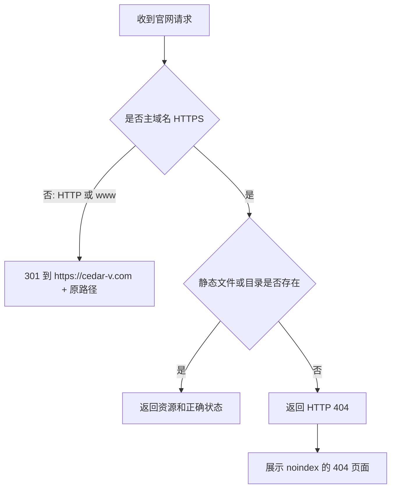
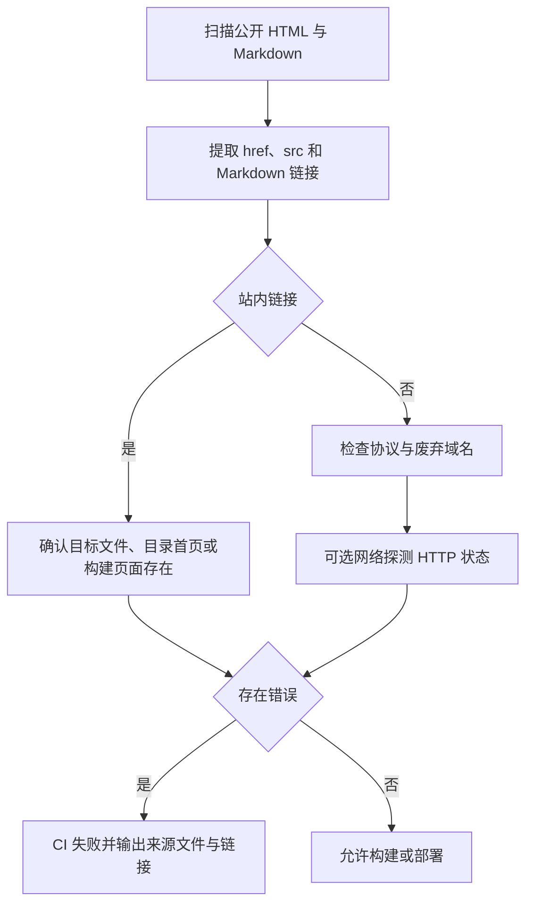

# GEO-02 官方地址与 HTTP 状态治理设计

## 方案概述

本设计落实《雪松授权云官方站群 GEO 优化计划》中的 GEO-02，治理官网 soft 404、www HTTPS、公开旧域名、明文 HTTP 演示入口和链接检查缺失问题。

本次以 `https://cedar-v.com/`、`https://docs.lm.cedar-v.com/` 和 `https://lic.cedar-v.com/` 为正式公开入口。仓库内能够修复的页面与 Nginx 配置直接纳入实现；DNS和证书签发等外部操作单独列出，不用代码提交冒充已完成。

## 实施前线上核验

核验时间：2026-08-18，使用真实 HTTP 请求检查。

| 地址 | 当前结果 | 结论 |
|------|----------|------|
| `https://cedar-v.com/` | `200` | 正常 |
| `https://cedar-v.com/geo-02-not-found-20260818` | `200` 且返回首页 | soft 404，必须修复 |
| `http://www.cedar-v.com/` | `301` 到 `https://www.cedar-v.com/` | 跳转目标不可用 |
| `https://www.cedar-v.com/` | TLS 主机名不匹配 | 证书未覆盖 www，必须外部处理 |
| `https://docs.lm.cedar-v.com/` | `200` | 正常 |
| 文档站随机不存在路径 | `404` | 正常，无需改路由 |
| `https://lic.cedar-v.com/` | `200` | 正式授权云入口正常 |
| `http://lm.cedar-v.com/` | `200` | 仍为明文 HTTP，不作为公开正式入口 |
| `https://lm.cedar-v.com/` | TLS 主机名不匹配 | 不可作为替代地址 |
| `https://api.lm.cedar-v.com/` | DNS 不存在 | 旧地址，必须从公开内容清除 |
| `https://lic.cedar-v.com/swagger/index.html` | `200` | 可替代旧 Swagger 地址 |

直接请求已部署文档站时，GEO-01 新文案已经生效；搜索抓取工具仍可能短暂显示缓存内容，属于后续重新抓取和索引刷新问题，不回滚当前部署。

## 数据模型变更

无数据库、服务端接口和 SDK 数据模型变更。

本次新增的站点状态约束为：

| 对象 | 目标状态 |
|------|----------|
| 官网有效页面 | 返回 `200` |
| 官网不存在页面 | 返回 `404` 并展示专用 404 页面 |
| `http://cedar-v.com/*` | 一次 `301` 到 `https://cedar-v.com/*` |
| `http://www.cedar-v.com/*` | 一次 `301` 到 `https://cedar-v.com/*` |
| `https://www.cedar-v.com/*` | 证书有效，一次 `301` 到 `https://cedar-v.com/*` |
| 文档站不存在页面 | 继续返回 `404` |
| 公开产品与 API 地址 | 只使用当前 HTTPS 正式入口 |

## 接口与外部地址设计

### 正式地址

| 用途 | 地址 |
|------|------|
| 公司与产品官网 | `https://cedar-v.com/` |
| 官方文档 | `https://docs.lm.cedar-v.com/` |
| 授权云产品与客户端 API 基址 | `https://lic.cedar-v.com/` |
| 在线 Swagger | `https://lic.cedar-v.com/swagger/index.html` |

### 废弃或限制地址

- `https://www.cedar-v.com` 只作为兼容入口，永久重定向到主域名，不承载独立正文。
- `https://api.lm.cedar-v.com` 已无 DNS，全部替换为 `https://lic.cedar-v.com`。
- `http://lm.cedar-v.com` 不再作为官网、文档和 `llms.txt` 的公开体验入口。
- 私有化演示改为“预约私有化演示”的联系入口，不把纯 HTTP 环境包装成公开正式站点。
- 中文与英文普通产品体验入口统一指向 `https://lic.cedar-v.com/`。

## 核心逻辑流程

### 官网请求处理



### 链接检查



## 官网仓库设计

仓库：`cedar-website`

### Nginx

修改 `nginx.conf`：

1. HTTP 下无论主域名还是 www，直接 `301` 到 `https://cedar-v.com$request_uri`，不再先跳到不可用的 www HTTPS。
2. 增加 www 的 HTTPS 重定向 server；证书文件必须先更新为同时覆盖 `cedar-v.com` 和 `www.cedar-v.com`。
3. 主站 `location /` 从首页回退改为 `try_files $uri $uri/ =404`。
4. 增加 `error_page 404 /404.html`，错误页仅展示导航，不改变 HTTP 404 状态。

### 404 页面

新增根目录 `404.html`：

- 标题明确页面不存在。
- `robots` 为 `noindex, follow`。
- 提供返回官网首页、雪松授权云产品页和官方文档的入口。
- 不通过 JavaScript 跳转，不返回伪首页正文。

### 公开链接

修改：

- `products/cedar-license-cloud/index.html`
- `llms.txt`

处理方式：

- 普通产品体验统一到 `https://lic.cedar-v.com/`。
- 私有化版本从纯 HTTP 演示链接改为联系入口和“预约私有化演示”。
- 页脚“产品演示”改为正式授权云入口。

### 部署工作流边界

官网仓库当前为私有仓库。按仓库所有者确认，保留 `.github/workflows/deploy.yml` 的连接凭据和 SSH/rsync 部署方式；仅在同一工作流中增加链接检查，并排除 `.ai`、`ops`、`scripts` 等非站点目录，避免再次发布到 Web 根目录。

## 文档仓库设计

仓库：`license-manager-docs`

### 地址替换

修改以下公开页面：

| 文件 | 修改 |
|------|------|
| `docs/index.md` | 官网链接由 www 改为主域名 |
| `docs/guide/getting-started.md` | 线上体验由 `lm` 改为 `lic` |
| `docs/en/index.md` | 英文线上体验由 `lm` 改为 `lic` |
| `docs/guide/cases/indie-developer-monetization.md` | API 基址由无 DNS 的 `api.lm` 改为 `lic` |
| `docs/en/guide/cases/indie-developer-monetization.md` | 同步英文案例 API 基址 |
| `docs/en/guide/api.md` | Swagger 改为已验证的 `https://lic.cedar-v.com/swagger/index.html` |

保留本地部署文档中的 `http://localhost:*`，这不是公开生产地址。

### robots 与死链忽略

- 删除 `docs/public/robots.txt` 中不存在的 `sitemap.html` 声明。
- 删除 VitePress 对 `http://lm.cedar-v.com` 的死链忽略规则；修复公开链接后不再需要该例外。

## 自动链接检查设计

两个仓库各增加无第三方运行时依赖的 Node.js 检查脚本，并接入现有 GitHub Actions：

1. 校验站内链接目标存在。
2. 拒绝 `www.cedar-v.com`、`api.lm.cedar-v.com` 和公开 `http://lm.cedar-v.com`。
3. 允许 sitemap XML 命名空间、本地开发 `localhost` 和明确的外部 HTTP 规范地址。
4. 对外部 HTTPS 链接执行超时与有限重试；雪松官方域名的 DNS、TLS、404 和错误重定向会阻断发布，第三方地址失败只输出警告，避免第三方网络波动阻塞 CI。
5. 输出来源文件、行号、原始链接和失败原因。

文档仓库在 VitePress 构建前执行；官网仓库在 rsync 部署前执行。脚本只读取公开源文件，不扫描 `.ai`、`.git`、构建产物和仓库外文件。

## 新增与修改文件清单

### `cedar-website`

新增：

- `.ai/_项目全局信息.md`
- `.ai/_项目开发规范.md`
- `404.html`
- `ops/certbot-reload-nginx.sh`
- `scripts/check-public-links.mjs`
- `package.json`

修改：

- `nginx.conf`
- `products/cedar-license-cloud/index.html`
- `llms.txt`
- `.github/workflows/deploy.yml`

### `license-manager-docs`

新增：

- `.ai/02-设计/20260818-GEO02官方地址与HTTP状态治理设计.md`
- `scripts/check-public-links.mjs`

修改：

- `docs/index.md`
- `docs/guide/getting-started.md`
- `docs/en/index.md`
- `docs/guide/cases/indie-developer-monetization.md`
- `docs/en/guide/cases/indie-developer-monetization.md`
- `docs/en/guide/api.md`
- `docs/public/robots.txt`
- `docs/.vitepress/config.mjs`
- `package.json`
- `.github/workflows/deploy.yml`

交付阶段新增 `.ai/03-交付/20260818-GEO02官方地址与HTTP状态治理交付.md`，并更新两个仓库的项目全局信息。

## 服务器操作清单

以下操作不能只靠仓库提交完成，需要在服务器执行并在交付文档记录结果：

1. 重新签发同时覆盖 `cedar-v.com` 与 `www.cedar-v.com` 的 TLS 证书，并保持 Nginx 配置引用路径一致。
2. 部署后从公网验证 www 重定向、随机 404 和正式入口。
3. 可选：确认 `lm.cedar-v.com` 是否保留为内部演示；即使保留，也不再作为公开站群入口。

## 验证方案

### 仓库验证

- 两个仓库执行链接检查，结果为零错误。
- 文档仓库执行 `npm run docs:build` 成功。
- 官网 Nginx 配置在服务器执行 `nginx -t` 成功后才重载。
- 全文扫描不再出现公开旧域名和不安全演示链接。

### 线上验收

```text
https://cedar-v.com/                         → 200
https://cedar-v.com/随机不存在路径           → 404
http://cedar-v.com/任意路径                  → 301 https://cedar-v.com/同路径
http://www.cedar-v.com/任意路径              → 301 https://cedar-v.com/同路径
https://www.cedar-v.com/任意路径             → 有效 TLS，301 https://cedar-v.com/同路径
https://docs.lm.cedar-v.com/随机不存在路径   → 404
https://lic.cedar-v.com/                     → 200
```

同时确认随机 404 的正文是错误页，不是首页；www 重定向不产生循环；公开页面和机器文件不再链接 `api.lm` 或明文 `lm`。

## 影响范围

### 正向影响

- 搜索与 AI 系统可以区分有效页面和不存在页面。
- www 与主域名收敛为单一正式 URL。
- 旧 API、HTTP 演示和失效 Swagger 不再误导用户。
- 链接错误会在部署前被发现。

### 不受影响

- License Manager 服务端接口与数据库。
- SDK 行为和许可证规则。
- 官网现有有效页面 URL。
- 文档站现有路由和页面正文结构。
- GEO-03 sitemap 自动生成与完整覆盖范围。

## 风险与控制措施

| 风险 | 影响 | 控制措施 |
|------|------|----------|
| 未先签发 www 证书就宣称修复 | HTTPS 仍在握手阶段失败 | 将证书签发列为独立外部验收项 |
| `try_files` 修改误伤有效目录 | 有效页面返回 404 | 对 sitemap 中全部官网 URL做冒烟测试 |
| 外链检查受短时网络波动影响 | CI 偶发失败 | 设置超时、有限重试并区分可达状态码 |
| 把私有化演示错误替换成 SaaS | 用户误解产品形态 | 私有化入口改为预约联系，SaaS 入口单独指向 `lic` |
| 把 sitemap 自动生成混入本次 | 扩大范围并影响 GEO-03 | 本次只删除错误声明，不重做 sitemap |

## 设计确认点

1. 官网不存在路径改为真实 404，并新增专用 404 页面。
2. www 只做主域名重定向；TLS 证书需要同时覆盖主域名与 www。
3. `api.lm` 全部替换为 `lic`，普通体验入口也统一到 `lic`。
4. 私有化演示不再公开链接纯 HTTP 环境，改为预约联系入口。
5. 官网私有仓库现有部署凭据与工作流保持不变。
6. 两个仓库都加入部署前链接检查；GEO-03 的 sitemap 自动生成留到下一项。
