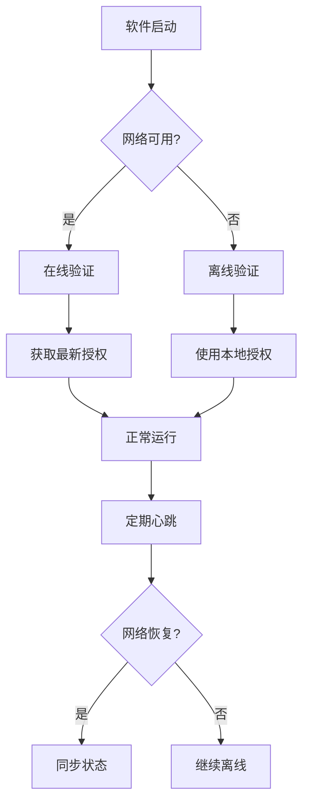

# 软件授权管理原理深度剖析：从技术实现到商业价值

> 作者：Cedar-V Team
> 发布时间：2025年01月17日
> 标签：软件授权、许可证管理、安全技术、商业化

## 前言

在数字化转型的今天，软件已经成为企业运营的核心资产。然而，如何保护软件资产、实现可持续商业化，一直是软件厂商面临的重大挑战。软件授权管理系统作为连接技术与商业的桥梁，扮演着越来越重要的角色。

今天，我们将深入剖析软件授权管理的技术原理、实现方式以及License Manager在这一领域的创新实践。

## 一、软件授权的基本概念

### 什么是软件授权？

软件授权（Software Licensing）是指软件厂商授予用户使用其软件的权利和限制条件的管理机制。它不仅仅是"防盗版"，更是软件产品商业化的核心工具。

从技术角度看，软件授权主要解决以下问题：

1. **身份验证**：确认用户是否有权使用软件
2. **权限控制**：限制软件功能、使用时长、并发数量等
3. **安全保护**：防止未经授权的复制和传播
4. **商业变现**：支持多种收费模式和订阅制

### 授权许可证的构成

一个完整的软件许可证通常包含以下核心要素：

```json
{
  "license_id": "LIC-2025-001",
  "product_info": {
    "name": "License Manager",
    "version": "1.0.5",
    "features": ["online_auth", "offline_auth", "device_binding"]
  },
  "validity": {
    "issue_date": "2025-01-01",
    "expire_date": "2025-12-31",
    "max_devices": 10
  },
  "constraints": {
    "hardware_binding": true,
    "fingerprint": "CPU:ABC123,MAC:00:11:22:33:44:55"
  },
  "signature": "RSA-PSS-SHA256-Signature"
}
```

## 二、授权模式的技术实现

### 1. 在线授权模式

**工作原理：**
```
客户端启动 → 本地验证 → 连接服务器 → 实时心跳 → 动态控制
```

**技术特点：**
- **实时通信**：通过RESTful API与授权服务器保持连接
- **动态控制**：服务器可以远程修改授权状态
- **心跳机制**：定期上报使用状态，确保授权有效性

**优势：**
- 实时监控和控制
- 支持动态授权调整
- 网络异常时可配置缓冲期

### 2. 离线授权模式

**工作原理：**
```
生成许可证 → 本地存储 → 客户端验证 → 定期检查 → 本地生效
```

**技术特点：**
- **本地验证**：无需网络连接即可验证授权
- **文件存储**：授权信息以加密文件形式存储
- **硬件绑定**：通过设备指纹防止许可证复制

**优势：**
- 无网络依赖，适用于离线环境
- 响应速度快，用户体验佳
- 安全性高，难以破解

### 3. 混合授权模式

结合在线和离线模式的优点，在线优先，离线兜底：



## 三、安全机制深度解析

### 1. 硬件绑定技术

硬件绑定是防止许可证被非法复制的核心技术：

**实现方式：**
- **设备指纹采集**：收集CPU序列号、MAC地址、主板信息等
- **指纹算法**：使用哈希算法生成唯一标识
- **动态验证**：运行时实时验证硬件一致性

**代码示例（Go）：**
```go
func GenerateHardwareFingerprint() string {
    var fingerprint strings.Builder

    // CPU信息
    if cpuInfo, err := GetCPUInfo(); err == nil {
        fingerprint.WriteString(fmt.Sprintf("CPU:%s,", cpuInfo.Serial))
    }

    // MAC地址
    if macAddr, err := GetMACAddress(); err == nil {
        fingerprint.WriteString(fmt.Sprintf("MAC:%s,", macAddr))
    }

    // 计算哈希
    hash := sha256.Sum256([]byte(fingerprint.String()))
    return hex.EncodeToString(hash[:])
}
```

### 2. 数字签名与加密

**RSA-PSS-SHA256签名流程：**
```
原始数据 → SHA256哈希 → PSS填充 → RSA私钥签名 → 验证时用公钥解密验证
```

**优势：**
- **不可伪造**：私钥签名，只有对应公钥能验证
- **完整性保证**：任何数据篡改都会导致验证失败
- **标准化**：符合国际安全标准

### 3. 状态管理机制

支持多种授权状态的动态管理：

| 状态 | 描述 | 用户体验 |
|------|------|----------|
| 正常 | 授权有效 | 功能完整 |
| 锁定 | 远程锁定 | 功能受限 |
| 过期 | 超出有效期 | 显示续费提示 |
| 警告 | 即将过期 | 提醒用户续费 |

## 四、License Manager的技术创新

### 1. 双端服务架构

**企业端（Admin Portal）：**
- 完整的授权生命周期管理
- 批量操作和自动化流程
- 数据分析和商业智能

**用户端（Self-Service Portal）：**
- 手机号注册登录
- 自助购买和升级
- 设备管理和发票服务

### 2. 灵活的授权策略

支持多维度授权配置：

```yaml
# 复杂授权策略示例
license_policy:
  name: "企业高级版"
  validity:
    type: "subscription"
    duration: "1_year"
    auto_renewal: true
  constraints:
    max_devices: 50
    max_concurrent: 20
    features: ["api_access", "advanced_analytics", "priority_support"]
  pricing:
    base_price: 9999
    currency: "CNY"
    billing_cycle: "monthly"
```

### 3. 智能监控与预警

**心跳数据分析：**
- 使用模式识别
- 异常行为检测
- 自动风险评估

**预警机制：**
- 实时告警通知
- 自动化处理流程
- 可视化监控面板

## 五、实际应用场景

### 1. SaaS软件授权

**挑战：** 多租户环境下如何精确控制每个用户的权限？

**解决方案：**
- 租户隔离的授权体系
- API调用量限制
- 功能模块的动态开关

### 2. 企业软件部署

**挑战：** 如何在企业内部网络管控软件使用？

**解决方案：**
- 硬件绑定确保单机授权
- 批量部署和集中管理
- 审计日志和合规报告

### 3. 试用版管理

**挑战：** 如何平衡用户体验和商业转化？

**解决方案：**
- 分层试用策略（功能限制、时间限制、次数限制）
- 试用数据分析
- 自动化升级流程

## 六、发展趋势与展望

### 1. 云原生授权

随着云计算的发展，授权系统正在向云原生架构演进：

- **Serverless部署**：降低运维成本
- **微服务架构**：提高系统可扩展性
- **容器化支持**：简化部署流程

### 2. AI驱动的智能授权

利用人工智能技术优化授权管理：

- **智能定价**：基于用户行为动态调整价格
- **风险预测**：提前识别潜在的授权滥用
- **个性化服务**：根据用户画像推荐合适的授权方案

### 3. 隐私保护与合规

在数据隐私日益重要的今天：

- **最小化数据收集**：只收集必要的授权验证信息
- **合规性保证**：满足GDPR、CCPA等隐私法规要求
- **透明化运营**：让用户清楚了解数据使用情况

## 七、总结

软件授权管理已经从简单的"防盗版"工具，演变为支持软件产品商业化、数字化运营的核心基础设施。通过技术创新和商业模式的优化，授权管理系统正在帮助越来越多的软件厂商实现可持续发展和商业成功。

License Manager作为这一领域的佼佼者，不仅提供了完善的技术解决方案，更开创了用户自助服务的全新模式，让授权管理变得简单、高效且用户友好。

**如果您正在寻找专业的软件授权管理解决方案，欢迎体验License Manager，让您的软件资产得到最佳保护，实现商业价值的最大化。**

---

*本文由Cedar-V Team团队撰写，如有技术问题或合作意向，欢迎通过官方网站或社区渠道与我们联系。*

官方链接：https://docs.lm.cedar-v.com