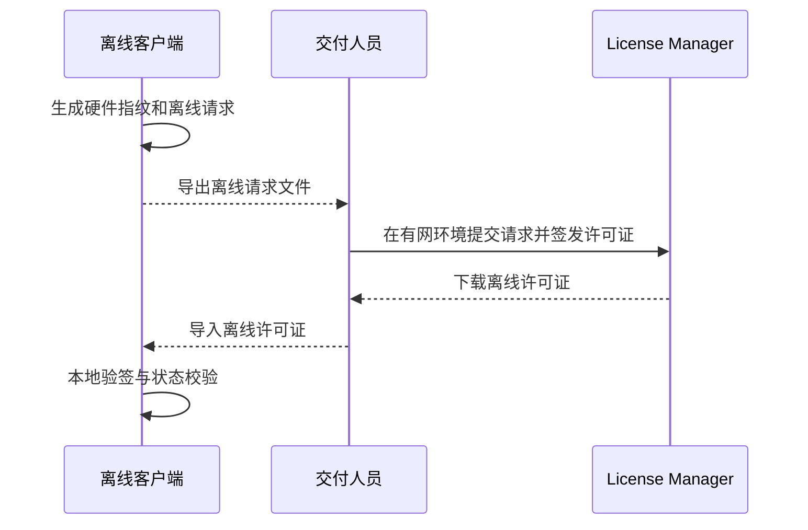

# 离线激活

离线激活适用于客户设备无法直接访问 License Manager 服务的场景，例如工厂内网、隔离网络、涉密环境或不允许连接公网的交付现场。

::: warning 发布前准备产品公钥
离线客户端发布前也必须从产品页面取得公钥，并将其内置到代码或只读资源。现场只导入许可证文件，不提供导入或替换公钥的入口。
:::

第一阶段文档说明推荐流程和交付边界。具体离线请求文件格式应以 SDK 和平台实际实现为准。

## 适用场景

- 客户生产设备无法访问公网
- 软件部署在隔离网络
- 现场只允许通过文件传递授权信息
- 客户要求授权校验不依赖实时联网

## 流程概览

## 推荐步骤

### 第一步：离线客户端生成请求

离线客户端应收集：

- 授权码或授权申请信息
- 硬件指纹
- 软件版本
- 设备基础信息

生成请求文件后交给有权限的交付人员。

### 第二步：有网环境签发许可证

交付人员在可访问 License Manager 的环境中完成授权校验和许可证签发。

签发时应确认：

- 授权码存在且未过期
- 授权码未锁定
- 当前设备未超过激活数量限制
- 硬件指纹与客户设备一致

### 第三步：离线客户端导入许可证

离线客户端导入许可证后，应完成：

1. 保存许可证文件
2. 使用发布客户端时已经内置的产品公钥
3. 本地验签
4. 检查授权状态和有效期
5. 检查硬件指纹
6. 根据授权配置控制业务功能

## 离线场景限制

| 限制 | 说明 |
|------|------|
| 状态同步不实时 | 云端锁定、续期或配置变更无法立即同步到离线设备 |
| 换机需要重新签发 | 硬件指纹变化后通常需要重新生成离线授权 |
| 时间校验依赖本机 | 客户端需要考虑系统时间被修改的风险 |
| 支持流程更依赖交付规范 | 请求文件、许可证文件和客户信息需要妥善管理 |

## 相关文档

- [本地许可证校验](./license-validation.md)
- [硬件指纹策略](./hardware-fingerprint.md)
- [常见问题排查](./troubleshooting.md)
- [生产上线检查清单](./production-checklist.md)
