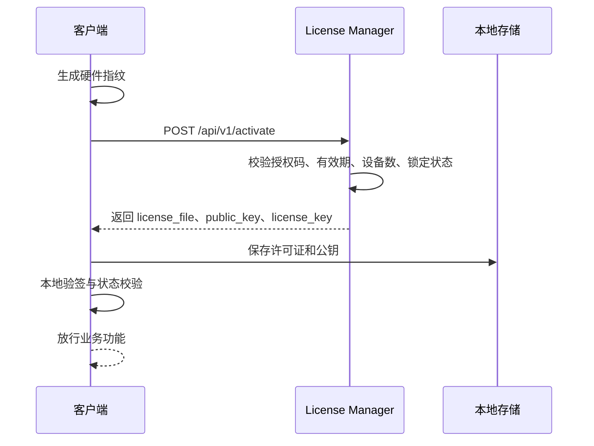

# 在线激活

在线激活适用于客户端首次运行时可以访问 License Manager 服务的场景。客户端提交授权码和硬件指纹，服务端校验通过后返回许可证和验签公钥。

## 适用场景

- 桌面软件首次启动时联网激活
- 工业软件在交付现场可临时联网激活
- 客户端需要后续通过心跳同步授权状态
- 软件需要根据云端变更更新本地许可证

## 流程概览



## 请求信息

接口：

```http
POST /api/v1/activate
```

关键字段：

| 字段 | 必填 | 说明 |
|------|------|------|
| `authorization_code` | 是 | 授权码 |
| `hardware_fingerprint` | 是 | 当前设备硬件指纹 |
| `software_version` | 否 | 客户端软件版本 |
| `device_info` | 否 | 设备信息，例如系统、主机名、版本等 |

请求体示例：

```json
{
  "authorization_code": "LIC-DEMO-XXXX-XXXX",
  "hardware_fingerprint": "demo-device-fingerprint",
  "software_version": "1.0.0",
  "device_info": {
    "os": "Windows",
    "hostname": "demo-pc"
  }
}
```

## 响应信息

激活成功后，`data` 中包含：

| 字段 | 说明 |
|------|------|
| `license_key` | 许可证密钥，用于心跳和服务端查询 |
| `license_file` | Base64 编码的许可证文件 |
| `public_key` | 用于验签的 RSA 公钥，PEM 格式 |
| `heartbeat_interval` | 心跳间隔，单位秒 |

客户端应将 `license_file` 与 `public_key` 配对保存，后续校验该许可证时使用同一次激活返回的公钥。

## 后续启动

激活成功后，客户端后续启动不应每次都强依赖在线激活。推荐顺序：

1. 读取本地许可证和公钥
2. 本地验签
3. 检查状态、有效期和设备指纹
4. 放行业务功能
5. 如果启用心跳，再异步或后台同步云端状态

## 常见失败

| 现象 | 常见原因 | 下一步 |
|------|----------|--------|
| 返回 400 | 请求字段缺失或格式错误 | 检查授权码和硬件指纹 |
| 返回 404 | 授权码不存在 | 确认授权码是否来自当前环境 |
| 返回 409 | 授权码已锁定、已过期或不可激活 | 查看授权状态和激活次数 |
| 验签失败 | 公钥与许可证不匹配或许可证文件损坏 | 查看 [常见问题排查](./troubleshooting.md) |

## 相关文档

- [AI 快速接入](./ai-quickstart.md)
- [原生 API 灵活对接](./quickstart.md)
- [本地许可证校验](./license-validation.md)
- [激活接口](./api/activation.md)
- [常见问题排查](./troubleshooting.md)
