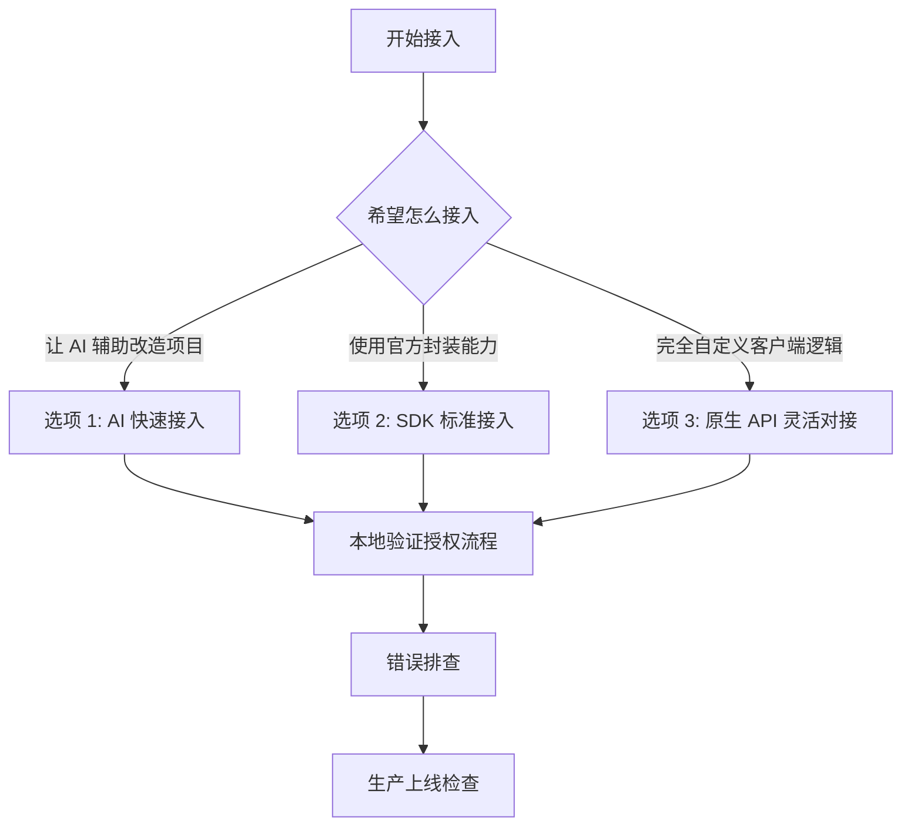

# 开发者中心

开发者中心面向需要把雪松授权云接入到自己软件中的工程团队。接入方式分为三类：AI 快速接入、SDK 标准接入、原生 API 灵活对接。

## 选择接入方式

| 选项 | 名称 | 适合谁 | 推荐程度 |
|------|------|--------|----------|
| 选项 1 | [AI 快速接入](./ai-quickstart.md) | 希望让 AI 辅助完成接入改造的团队 | 首推 |
| 选项 2 | [SDK 标准接入](./sdk/) | 使用官方 SDK，希望最少处理底层验签和心跳细节的团队 | 推荐 |
| 选项 3 | [原生 API 灵活对接](./quickstart.md) | 暂无 SDK 语言、已有授权框架、或需要完全自定义客户端逻辑的团队 | 高级 |

## 三种方式的差异

| 维度 | AI 快速接入 | SDK 标准接入 | 原生 API 灵活对接 |
|------|-------------|--------------|------------------|
| 接入速度 | 最快，AI 可直接根据文档改造项目 | 快，SDK 封装常见流程 | 较慢，需要自行实现完整流程 |
| 需要理解的细节 | 中等，重点是给 AI 足够上下文 | 较少，按 SDK 流程接入 | 较多，需要理解接口、验签、心跳、错误码 |
| 适合语言 | 任意语言，只要 AI 能读项目 | 已提供 SDK 的语言 | 任意语言 |
| 可控性 | 取决于您给 AI 的约束和审核 | 标准化，适合大多数客户 | 最高，适合深度定制 |
| 主要风险 | 需要人工审查 AI 生成的代码 | 依赖 SDK 成熟度 | 容易遗漏验签、错误码、心跳失败策略 |

## 推荐路径

## 常用入口

| 任务 | 文档 |
|------|------|
| 让 AI 辅助接入 | [AI 快速接入](./ai-quickstart.md) |
| 使用 SDK 接入 | [SDK 总览](./sdk/) |
| 使用 C# SDK | [C# SDK 接入](./sdk/csharp.md) |
| 查看 C# SDK 仓库 | [cedar-v/license-manager-dotnet](https://github.com/cedar-v/license-manager-dotnet.git) |
| 直接调用 API | [原生 API 灵活对接](./quickstart.md) |
| 查看接口细节 | [API 总览](./api/) |
| 有网络环境下激活 | [在线激活](./activation-online.md) |
| 无外网环境下授权 | [离线激活](./activation-offline.md) |
| 本地验签与状态校验 | [本地许可证校验](./license-validation.md) |
| 设备绑定策略 | [硬件指纹策略](./hardware-fingerprint.md) |
| 激活失败排查 | [常见问题排查](./troubleshooting.md) |
| 正式发布前检查 | [生产上线检查清单](./production-checklist.md) |

## 示例环境

本文档统一使用以下占位值：

| 类型 | 示例 |
|------|------|
| 平台地址 | `https://lic.cedar-v.com/` |
| API 地址 | `https://lic.cedar-v.com` |
| 产品编码 | `demo-app` |
| 授权码 | `LIC-DEMO-XXXX-XXXX` |
| API Key | `sk_demo_xxxxxxxxxxxxxxxx` |
| 许可证文件 | `license.dat` |
| 公钥文件 | `public_key.pem` |

::: warning 注意
这些值只用于说明文档结构，不能作为生产凭证使用。实际接入时请使用雪松授权云平台为您生成的授权码、许可证和 API 凭证。
:::

## 与现有指南的关系

- 第一次接入且希望 AI 辅助改造项目，请从 [AI 快速接入](./ai-quickstart.md) 开始。
- 希望少写底层逻辑，请从 [SDK 标准接入](./sdk/) 开始。
- 希望完全自定义客户端逻辑，请阅读 [原生 API 灵活对接](./quickstart.md) 和 [API 总览](./api/)。
