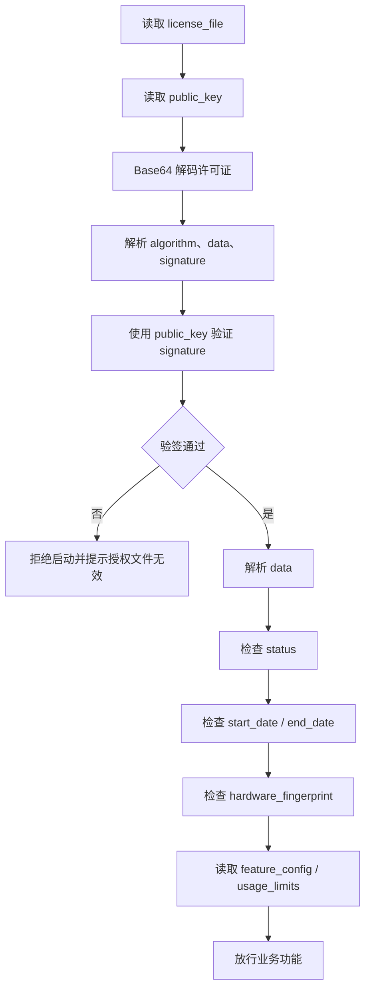

# 本地许可证校验

客户端激活成功后，应优先依赖本地许可证完成启动校验。即使是在线或混合模式，也不建议把每次启动都设计成强实时联网鉴权。

## 客户端需要保存什么

首次激活成功后，至少保存：

| 内容 | 说明 |
|------|------|
| `license_file` | Base64 编码的许可证文件 |
| `public_key` | 验签许可证使用的 RSA 公钥 |

启用心跳时还需要保存：

| 内容 | 说明 |
|------|------|
| `license_key` | 心跳接口使用的许可证密钥 |
| `heartbeat_interval` | 建议心跳间隔 |

## 校验顺序

## 关键校验项

| 校验项 | 处理建议 |
|--------|----------|
| 签名 | 必须先验签，再读取业务授权内容 |
| 状态 | `normal` 才能正常放行，`locked` 和 `expired` 应阻断或降级 |
| 有效期 | 检查当前时间是否在授权期内 |
| 硬件指纹 | 当前设备指纹应与许可证中的指纹一致 |
| 功能配置 | 根据 `feature_config` 控制模块开关 |
| 使用限制 | 根据 `usage_limits` 控制数量、额度或频率 |
| 自定义参数 | 根据 `custom_parameters` 映射业务参数 |

## 公钥与许可证关系

当前激活接口会返回当前许可证对应的 `public_key`。客户端应将该公钥与许可证配对保存，后续校验该许可证时优先使用同一次激活返回的公钥。

不要假设所有许可证都共享同一把固定公钥，也不要把 A 许可证的公钥用于校验 B 许可证。

## 常见失败

| 现象 | 可能原因 |
|------|----------|
| 签名验证失败 | 公钥和许可证不匹配、许可证文件损坏、验签前重新序列化了 `data` |
| 授权已过期 | 本地时间超过许可证 `end_date` |
| 设备不匹配 | 当前硬件指纹和许可证绑定指纹不一致 |
| 功能不可用 | `feature_config` 未包含该功能，或使用额度已达上限 |

## 相关文档

- [许可证结构与验证](/guide/license-token-structure.md)
- [在线激活](./activation-online.md)
- [常见问题排查](./troubleshooting.md)

