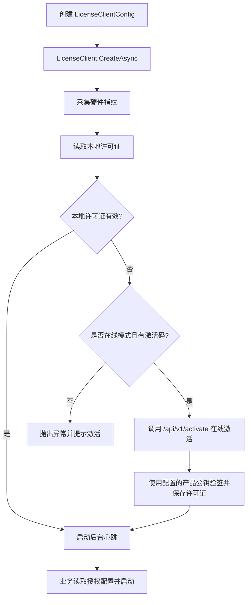

# C# SDK 接入

C# SDK 是第一阶段推荐的标准接入方式，适用于 .NET Framework 4.8、.NET 6 及以上版本的桌面软件、工业上位机、客户端工具和需要本地许可证校验的业务系统。

SDK 仓库地址：[cedar-v/license-manager-dotnet](https://github.com/cedar-v/license-manager-dotnet.git)

## 适用场景

- 希望少处理底层 HTTP 接口、验签和心跳细节。
- 需要在线激活后在本地保存许可证文件。
- 需要在程序启动时做本地许可证校验。
- 需要在运行期通过心跳同步授权状态和授权配置变更。
- 需要支持 Windows 桌面、WinForms/WPF、控制台服务或其他 .NET 客户端程序。

## SDK 信息

| 项目 | 说明 |
|------|------|
| 包名 | `LicenseManager.DotNet` |
| 命名空间 | `LicenseManager.DotNet`、`LicenseManager.DotNet.Configuration` |
| 默认授权服务 | `https://lic.cedar-v.com` |
| 支持框架 | `net48`、`net6.0` |
| 核心能力 | 在线激活、本地许可证校验、心跳同步、授权配置更新、硬件指纹采集 |
| 示例项目 | 仓库中的 `demo/LicenseUiDemo` |

## 获取 SDK

如果已经发布到内部或公开 NuGet 源，可以直接安装：

```bash
dotnet add package LicenseManager.DotNet
```

如果当前项目通过源码仓库交付，可以先拉取并打包：

```powershell
git clone https://github.com/cedar-v/license-manager-dotnet.git
cd license-manager-dotnet
dotnet build .\license-manager-dotnet.sln
dotnet pack .\license-manager-dotnet\license-manager-dotnet.csproj -c Release
```

然后在业务项目中引用生成的 `.nupkg`，或在解决方案中直接引用 SDK 项目。

## 最小在线接入

在线模式下，开发者先从产品页面获取产品公钥并配置到 SDK。首次启动时 SDK 会采集硬件指纹、读取本地许可证；如果本地没有有效许可证，则使用激活码调用雪松授权云平台完成在线激活。SDK 使用配置的产品公钥验签、保存许可证文件并启动后台心跳，业务代码无需处理接口响应中的公钥。

```csharp
using LicenseManager.DotNet;
using LicenseManager.DotNet.Configuration;
using System.Text;

const string ProductPublicKeyPem = @"-----BEGIN PUBLIC KEY-----
请替换为产品页面获取的完整公钥
-----END PUBLIC KEY-----";

var config = new LicenseClientConfig
{
    Server = "https://lic.cedar-v.com",
    Product = "my-product",
    Version = "1.0.0",
    AuthorizationCode = "LIC-XXXX-XXXX",
    LicenseFilePath = "license_code/license.lic",
    PublicKeyPem = Encoding.UTF8.GetBytes(ProductPublicKeyPem),
    HardwareFields = new List<string> { "hostname", "cpu" },
    HeartbeatIntervalSeconds = 600
};

using var client = await LicenseClient.CreateAsync(config);

client.Validate();

var license = client.CurrentLicense();
Console.WriteLine($"授权状态：{license?.Status}");
Console.WriteLine($"到期时间：{license?.ExpiresAt:u}");
```

接入时建议把 `Product` 配置为雪松授权云平台中的产品标识，并保持客户端版本号 `Version` 与实际软件版本一致。

## 配置项

| 配置项 | 必填 | 说明 |
|------|------|------|
| `Server` | 在线模式必填 | 授权服务地址，默认使用 `https://lic.cedar-v.com` |
| `Product` | 是 | 产品标识，SDK 会校验许可证中的产品标识是否一致 |
| `Version` | 是 | 当前软件版本，会随激活和心跳上报 |
| `AuthorizationCode` | 首次在线激活必填 | 激活码，也可以通过 `AuthorizationCodePath` 从文件读取 |
| `LicenseFilePath` | 否 | 本地许可证文件路径，默认 `license_code/license.lic` |
| `PublicKeyPath` / `PublicKeyPem` | 正式接入必填 | 从产品页面获取的产品公钥，作为客户端固定验签信任根 |
| `Offline` | 否 | 是否启用离线模式 |
| `HardwareFields` | 否 | 硬件指纹字段，推荐默认 `hostname`、`cpu` |
| `HeartbeatIntervalSeconds` | 否 | 本地默认心跳间隔；服务端心跳响应可覆盖下一轮间隔 |
| `HttpTimeoutSeconds` | 否 | HTTP 超时时间，未配置时默认 15 秒 |
| `DeviceInfo` | 否 | 激活时上报的设备信息 |
| `Metadata` | 否 | 激活时上报的扩展信息 |
| `HttpHeaders` | 否 | 自定义请求头 |

## 启动流程



## 读取授权配置

`CurrentLicense()` 返回当前许可证载荷副本，业务侧可以读取功能开关、额度限制和自定义授权参数。

```csharp
var license = client.CurrentLicense();
if (license == null)
{
    throw new InvalidOperationException("未加载许可证");
}

var features = license.FeatureConfig;
var usageLimits = license.UsageLimits;
var customParameters = license.CustomParameters;
```

常用字段：

| 字段 | 用途 |
|------|------|
| `LicenseKey` | 许可证 Key，排查心跳和授权问题时使用 |
| `AuthorizationCode` | 对应的授权码 |
| `HardwareFingerprint` | 许可证绑定的硬件指纹 |
| `Status` | 许可证状态 |
| `Product` | 产品标识 |
| `Version` | 软件版本 |
| `StartDate` / `EndDate` | 授权开始和结束时间 |
| `ExpiresAt` | SDK 当前用于判断过期的时间 |
| `FeatureConfig` | 功能开关配置 |
| `UsageLimits` | 使用额度限制 |
| `CustomParameters` | 业务自定义授权参数 |
| `ConfigUpdatedAt` | 授权配置更新时间 |

## 心跳与回调

在线模式下，SDK 会自动启动后台心跳。业务也可以手动触发一次心跳：

```csharp
var heartbeat = await client.SendHeartbeatAsync();
Console.WriteLine($"心跳状态：{heartbeat.Status}");
```

建议业务系统配置回调，用于记录日志、提示重新激活或处理授权配置更新。

```csharp
var callbacks = new LicenseCallbacks
{
    OnLicenseUpdated = license =>
    {
        Console.WriteLine($"许可证已更新，到期时间：{license.ExpiresAt:u}");
        return Task.CompletedTask;
    },
    OnHeartbeatError = error =>
    {
        Console.WriteLine($"心跳异常：{error.Message}");
        return Task.CompletedTask;
    },
    OnActivationRequired = reason =>
    {
        Console.WriteLine($"需要重新激活：{reason}");
        return Task.CompletedTask;
    },
    OnHeartbeatPing = () =>
    {
        Console.WriteLine("心跳成功");
        return Task.CompletedTask;
    },
};

using var client = await LicenseClient.CreateAsync(config, new LicenseClientOptions
{
    Callbacks = callbacks
});
```

回调触发规则：

| 回调 | 触发条件 |
|------|------|
| `OnLicenseUpdated` | SDK 成功应用新的许可证文件 |
| `OnHeartbeatError` | 后台心跳请求异常，或服务端返回非 `000000` |
| `OnActivationRequired` | 激活失败，或心跳返回 `status == "activation_required"` |
| `OnHeartbeatPing` | 后台心跳成功返回 |

## 错误处理

服务端返回非 `000000` 时，SDK 会抛出 `LicenseApiException`。业务侧应读取 `Code`，不要只判断 HTTP 状态码。

```csharp
try
{
    using var client = await LicenseClient.CreateAsync(config);
    client.Validate();
}
catch (LicenseApiException ex)
{
    Console.WriteLine($"接口范围：{ex.Scope}");
    Console.WriteLine($"错误码：{ex.Code}");
    Console.WriteLine($"错误信息：{ex.ApiMessage}");
    Console.WriteLine($"HTTP 状态：{ex.HttpStatusCode}");
}
catch (Exception ex)
{
    Console.WriteLine($"授权初始化失败：{ex.Message}");
}
```

常见处理建议：

| 场景 | 建议处理 |
|------|----------|
| 激活码不存在、过期或产品不匹配 | 提示用户检查激活码和产品版本，必要时联系授权管理员 |
| 激活数量已达上限 | 提示释放旧设备或申请增加激活数量 |
| 许可证不存在或已撤销 | 停止受控业务能力，并提示重新激活或联系授权管理员 |
| 本地验签失败 | 删除异常许可证文件后重新激活 |
| 网络不可达 | 如果本地许可证仍有效，可按业务策略继续运行，并记录心跳异常 |

更完整的错误码和 JSON 示例见 [API 总览](../api/)。

## 离线模式

离线模式适用于无法访问雪松授权云平台的环境。离线模式不会调用在线激活接口，也不会启动后台心跳，因此无法实时同步撤销状态和授权配置变更。

```csharp
var config = new LicenseClientConfig
{
    Product = "my-product",
    Version = "1.0.0",
    Offline = true,
    LicenseFilePath = "license_code/license.lic",
    PublicKeyPem = Encoding.UTF8.GetBytes(ProductPublicKeyPem),
    HardwareFields = new List<string> { "hostname", "cpu" }
};

using var client = await LicenseClient.CreateAsync(config);
client.Validate();
```

离线模式要求本地已经存在许可证文件，并通过 `PublicKeyPath` 或 `PublicKeyPem` 配置产品公钥。在线和离线模式使用同一产品公钥信任边界。

## 示例项目

SDK 仓库提供了 WinForms 示例项目：

```powershell
git clone https://github.com/cedar-v/license-manager-dotnet.git
cd license-manager-dotnet
dotnet run --project .\demo\LicenseUiDemo\LicenseUiDemo.csproj
```

示例默认使用：

- 授权服务：`https://lic.cedar-v.com`
- 产品标识：`my-product`
- 软件版本：`1.0.0`
- 硬件指纹字段：`hostname`、`cpu`
- 心跳间隔：600 秒

## 下一步

- [SDK 总览](./)
- [在线激活](../activation-online.md)
- [本地许可证校验](../license-validation.md)
- [API 总览](../api/)
- [生产上线检查清单](../production-checklist.md)
