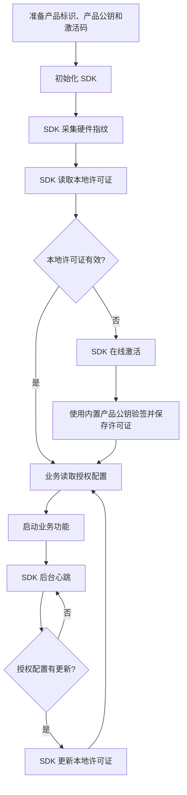

# SDK 总览

License Manager SDK 用于封装客户端常见授权能力，包括在线激活、许可证保存、本地验签、状态校验、硬件指纹和运行期心跳。

SDK 可以减少底层接口和心跳处理工作，并支持把产品公钥配置为客户端固定信任根。新项目也可以使用 AI 原生 API 接入，让 AI 按相同安全边界直接完成业务集成。

## 当前推荐

第一阶段推荐使用 C# SDK 作为标准接入入口：

| 语言 | 状态 | 文档 |
|------|------|------|
| C# / .NET | 已提供 SDK 仓库，推荐优先接入 | [C# SDK 接入](./csharp.md) |
| HTTP API | 已开放，适合自定义封装 | [原生 API 灵活对接](../quickstart.md) |
| 其他语言 | 可按 API 文档自行封装 | [API 总览](../api/) |

C# SDK 仓库地址：[cedar-v/license-manager-dotnet](https://github.com/cedar-v/license-manager-dotnet.git)

## SDK 应覆盖的能力

| 能力 | 说明 |
|------|------|
| 硬件指纹 | 自动或半自动生成设备唯一标识 |
| 在线激活 | 调用 `/api/v1/activate` 获取许可证 |
| 本地保存 | 保存许可证；产品公钥随程序只读交付 |
| 本地验签 | 使用客户端内置产品公钥验证许可证签名 |
| 授权状态校验 | 检查状态、有效期和设备绑定 |
| 业务配置读取 | 读取功能开关、使用限制和自定义参数 |
| 心跳同步 | 调用 `/api/v1/heartbeat` 同步运行期状态 |
| 授权配置更新 | 心跳返回新许可证文件时自动应用 |
| 异常回调 | 将激活异常、心跳异常、重新激活提示暴露给业务层 |

## 推荐接入流程



## C# SDK 快速示例

```csharp
using LicenseManager.DotNet;
using LicenseManager.DotNet.Configuration;
using System.Text;

const string ProductPublicKeyPem = @"-----BEGIN PUBLIC KEY-----
请替换为产品页面获取的完整公钥
-----END PUBLIC KEY-----";

var config = new LicenseClientConfig
{
    Server = "https://lic.cedar-v.com",
    Product = "my-product",
    Version = "1.0.0",
    AuthorizationCode = "LIC-XXXX-XXXX",
    LicenseFilePath = "license_code/license.lic",
    PublicKeyPem = Encoding.UTF8.GetBytes(ProductPublicKeyPem),
    HardwareFields = new List<string> { "hostname", "cpu" },
    HeartbeatIntervalSeconds = 600
};

using var client = await LicenseClient.CreateAsync(config);
client.Validate();

var license = client.CurrentLicense();
```

完整说明见 [C# SDK 接入](./csharp.md)。

## 相关文档

- [AI 快速接入](../ai-quickstart.md)
- [原生 API 灵活对接](../quickstart.md)
- [本地许可证校验](../license-validation.md)
- [常见问题排查](../troubleshooting.md)
