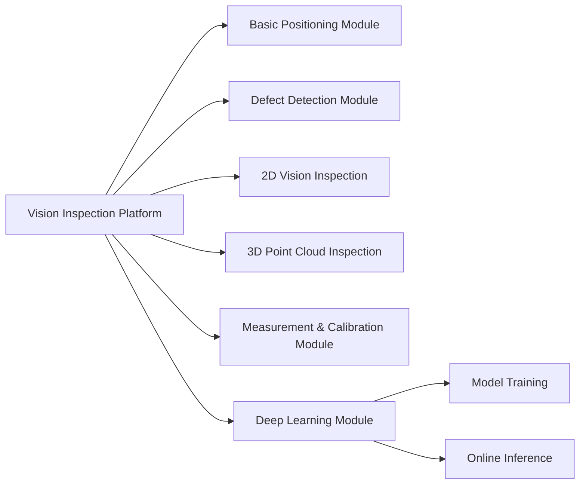

# Flexible Licensing Solutions for Machine Vision Inspection Software

## Customer Background

An industrial vision inspection software provider delivers solutions across precision manufacturing scenarios including PCB board-level inspection, lithium battery coating defect identification, and 3C component appearance detection.

As their customer base expanded, the traditional "one order, one license" model revealed critical pain points:

- **Coarse licensing granularity**: device- or project-based licensing made it impossible to bill flexibly by inspection station, vision algorithm module, or runtime
- **Rigid hardware binding**: frequent production line changeovers meant every machine swap required a new license application, driving up operational costs
- **Monolithic business model**: only perpetual purchase was supported, with no access to rental, installment, or subscription options
- **High piracy risk**: software could be copied, hardware fingerprints were easily spoofed, and licensing was effectively toothless

## Solution

Built on License Manager's flexible authorization architecture, a multi-layered licensing framework was customized for this provider:

### 1. Fine-Grained Authorization by Algorithm Module

The vision inspection software was broken into independently licensed algorithm modules:

Modules are independently priced — customers purchase what they need, dramatically lowering the barrier to entry and unlocking cross-sell opportunities. Average modules purchased per customer rose from 1.2 to 2.8.

### 2. Multi-Dimensional Hardware Fingerprint Binding

A composite fingerprint strategy addresses the reality of frequent production line changeovers:

| Binding Level | Fingerprint Sources | Use Case | Changeover Friendliness |
|---|---|---|---|
| **Relaxed** | MAC address only | Fixed-station devices | ⭐ |
| **Standard** | MAC + CPU serial | Standard production lines | ⭐⭐⭐ |
| **Strict** | MAC + CPU + motherboard + HDD serial | High-security environments | ⭐⭐⭐⭐⭐ |

Changeover quotas are supported: each license period allows N free device swaps, with additional swaps auto-approved upon admin authorization.

### 3. Multi-Tenant Sub-License Management

Large factories typically have independently-accounted business units or subsidiaries. License Manager's tenant hierarchy enables:

- HQ distributes authorization quotas centrally
- Each business unit manages sub-accounts and device quotas independently
- Usage and billing tracked per business unit

### 4. Hybrid Authorization Modes

Different network conditions call for different modes:

| Mode | Description | Typical Customer |
|---|---|---|
| **Cloud (Online)** | Client connects to license server in real time; validated on every startup | Modern factories with stable connectivity |
| **Standalone (Offline)** | License file stored locally; runs offline, syncs periodically | Military and classified workshops with no external network |
| **Hybrid** | Local validation + periodic heartbeat; continues running during network outages | Remote facilities with unreliable connectivity |

### 5. Tamper-Proof Security

- **RSA-PSS-SHA256 signatures**: license files are signed — any modification is immediately detected
- **AES-256 data encryption**: license content encrypted at rest, preventing direct reading or analysis
- **Heartbeat verification with dynamic salt**: online mode heartbeats include dynamic salt values, preventing replay attacks
- **Client code obfuscation**: SDK integration supports code obfuscation to raise the bar on reverse engineering

## Business Outcomes

After 6 months in production:

- **+40% licensing revenue**: module-level pricing raised average modules purchased from 1.2 → 2.8 per customer
- **−85% changeover tickets**: relaxed binding + changeover quotas dramatically reduced operational overhead
- **Piracy rate dropped from ~15% to <1%**: hardware fingerprinting + signature verification effectively halted unauthorized copying
- **Subscription renewal rate: 78%**: rental and subscription models attracted budget-constrained SMEs
- **Deployment cycle: 2 weeks → 3 days**: standardized deployment packages + bulk import tooling

## Summary

This case demonstrates how License Manager's four core capabilities — **modular authorization design**, **composite hardware fingerprint binding**, **multi-tenant management**, and **hybrid authorization modes** — helped an industrial software provider make the leap from "selling software" to "selling services," boosting revenue while significantly reducing licensing management and operational costs.
