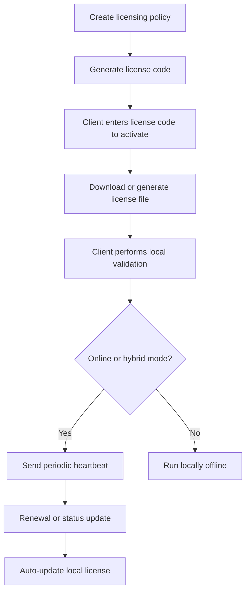

# Introduction

License Manager is a software licensing management system for software vendors, implementation teams, and independent developers. It helps manage the key steps in the licensing lifecycle, including **license code generation, license delivery, client-side validation, renewal updates, and runtime control**.

For many software teams, the hard part is not just "how to validate a license once." The real challenge is turning **license distribution, activation, device binding, renewal, offline delivery, and runtime management** into a stable delivery workflow. License Manager is built to centralize these capabilities so teams do not have to rebuild them in every project.

## What Problems Does It Solve?

If your software needs to control who can use it, how long it can be used, how many devices can be activated, or which features are available, you will usually run into a few common problems:

- Licensing rules are scattered across client code, making later changes costly
- The software is already delivered, but there is no consistent process for issuing codes, activation, and renewal
- Customer environments are mixed, with both online and fully offline deployment scenarios
- You need to limit device count or bind licenses to specific machines
- You need to change license status or validity without shipping a new version of the software

License Manager is designed to provide a practical way to handle exactly these issues.

## Core Capabilities

### License Codes and License Files

The system supports creating license codes around your product and generating or distributing license files based on licensing policies.

- Define policies for validity period, activation count, feature scope, and more
- Batch-create license codes for bulk delivery or unified import workflows
- Generate license files from device information for formal software delivery
- Adjust license status, such as normal, locked, or expired

### Online, Offline, and Hybrid Deployment

The system supports multiple deployment modes so it can fit real customer environments.

- **Online mode (Cloud)**: local client validation plus server heartbeat, suitable for remote renewal, status sync, and runtime control
- **Offline mode (Standalone)**: device-bound license files with local validation, suitable for intranet, industrial, or isolated environments
- **Hybrid mode (Hybrid)**: prioritizes the online path while retaining limited offline availability, balancing control and usability

### Client-Side Local Validation

At runtime, the client does not rely on real-time online verification every time. Instead, the core validation happens locally based on the license file.

- License data is protected by signatures, and the client can verify it with a public key
- Hardware fingerprints can be used for device binding
- The client can evaluate status, validity, feature configuration, and usage limits from the license content
- Even in online scenarios, the final allow/deny decision can still happen locally

### Runtime Control and Renewal Updates

For online or hybrid deployments, the system can continue managing license status after the software has been delivered and activated.

- Clients can report periodic heartbeats
- The server can decide whether a license update is required
- After renewal, expansion, or status changes, the client can automatically download an updated license and refresh its local state
- This makes ongoing management easier for support, operations, and implementation teams

### SDK and Integration

License Manager provides client SDKs to help developers integrate licensing much faster.

The SDK already covers a common set of building blocks, including:

- Public key download
- License file download
- License parsing and signature verification
- Activation flow handling
- Device binding and basic license checks

This means development teams do not need to repeatedly implement license parsing, signature validation, and activation logic in every client project.

## Typical Scenarios

### Enterprise Software Delivery

When delivering desktop software, server-side programs, or industry-specific systems to enterprise customers, you often need to control licensing by customer, device count, validity period, or feature module. In these cases, License Manager can centralize code generation, license delivery, and later renewals.

### Offline Environment Licensing

If the software runs in intranets, industrial sites, production environments, or other scenarios without internet access, you can use offline mode: collect the device fingerprint first, generate a machine-bound license file, and let the client validate it locally.

### Online Trial and Paid Renewal

If you want to offer a trial first and then convert users to a paid license later, online or hybrid mode is a practical option. After the first activation, the client can continue to receive renewal or license updates through heartbeat-based communication, without requiring manual re-issuance every time.

### Selling Software as an Independent Developer

For products such as plugins, desktop utilities, and lightweight industry tools, the software itself can be distributed through communities, content platforms, or card-selling platforms. License Manager handles the licensing, activation, and validation steps behind the scenes, making the sales workflow easier to maintain over time.

## A Simplified Workflow

The diagram below shows the most common workflow in the system:

```mermaid
flowchart TD
    A[Create licensing policy] --> B[Generate license code]
    B --> C[Client enters license code to activate]
    C --> D[Download or generate license file]
    D --> E[Client performs local validation]
    E --> F{Online or hybrid mode?}
    F -->|Yes| G[Send periodic heartbeat]
    G --> H[Renewal or status update]
    H --> I[Auto-update local license]
    F -->|No| J[Run locally offline]
```

In this workflow:

1. The admin side defines the licensing policy
2. The client completes first-time activation with a license code
3. The system delivers or generates a license file based on deployment mode
4. The client validates the license locally
5. In online or hybrid mode, later renewals and status sync happen through heartbeat updates

## Who Is It For?

This system is a good fit for the following kinds of teams and products:

- Software teams that need commercial licensing
- Desktop clients or edge software that need device activation limits
- Industry software, industrial software, or embedded companion software that must support offline delivery
- Product teams that need unified management for trials, paid licenses, renewals, and status updates
- Development teams that want to integrate licensing quickly instead of building a full license system from scratch

## Recommended Reading Order

If this is your first time using License Manager, we recommend reading in this order:

1. Start with [Getting Started](./getting-started.md) to learn how to deploy the system
2. Then read [Operating Guide](./operating_guide.md) to understand licensing, distribution, activation, and renewal workflows
3. If you need client integration, continue with [Client SDK](./sdk.md) and [License Structure & Validation](./license-token-structure.md)
4. If you want to experience the client workflow first, check [Client Authorization Test Tool](./client-simulator.md)
5. If you need system integration, see [API Reference](./api.md)

## Related Documents

- [Getting Started](./getting-started.md)
- [Operating Guide](./operating_guide.md)
- [Client SDK](./sdk.md)
- [License Structure & Validation](./license-token-structure.md)
- [Client Authorization Test Tool](./client-simulator.md)
- [API Reference](./api.md)
- [Why You Need a License Management System](./why/why-you-need-license-management.md)
- [Flexible Licensing for Machine Vision Inspection Software](./cases/machine-vision-licensing.md)
- [Instant Monetization for Independent Developers](./cases/indie-developer-monetization.md)
