# Introduction

License Manager is an independent software licensing management system that provides license code generation, distribution, validation, and management services for software systems. It supports both online and offline licensing modes, with hardware-based binding mechanisms ensuring security.

## System Overview

License Manager is an enterprise-grade software licensing management solution that helps software vendors achieve a complete lifecycle management cycle from license generation, distribution, validation to full lifecycle management. The system adopts a frontend-backend separation architecture, providing an intuitive management interface and rich API interfaces, supporting multiple deployment modes to meet licensing management needs in different scenarios.

## Core Features

### 🔐 Flexible Licensing Modes

- **Online Licensing (Cloud)**: Local verification + heartbeat reporting, with remote control and management
- **Offline Licensing (Standalone)**: Hardware fingerprint binding, verification without network connection
- **Hybrid Mode**: Local verification + heartbeat reporting, allow short-term offline operation when disconnected

### 🛡️ Security Mechanisms

- **Hardware Binding**: Prevent license copying through device fingerprints (MAC, CPU, HostID, etc.)
- **Digital Signatures**: RSA-PSS-SHA256 signatures ensure license data integrity
- **State Management**: Support multiple states including normal, locked, expired, with remote control capabilities
- **Key Encryption**: Encrypted storage and transmission of license data

### 📊 Full Lifecycle Management

- **Customer Management**: Unified maintenance of customer profiles, contacts, and license relationships
- **License Generation**: Batch generation, custom validity periods, feature restriction configuration
- **Status Monitoring**: Real-time license status viewing, usage statistics
- **Operation Auditing**: Complete operation log records for traceability and auditing

### 🚀 Easy Integration

- **RESTful API**: Standardized API interfaces, easy to integrate with existing systems
- **Client SDK**: Client verification libraries in multiple languages
- **Deployment Package Generation**: Automatically generate deployment packages with configuration, simplifying delivery processes

## System Architecture

The system adopts a modern **frontend-backend separation architecture** design, with the backend built on the high-performance **Go (Golang)** language. This architecture design ensures system stability under high-concurrency scenarios while greatly simplifying enterprise deployment and operational costs.

### Core Components

```mermaid
graph TD
    UI[💻 Frontend Admin Interface<br/>Vue.js 3 + Modern UI]
    API[⚙️ Backend Core Engine<br/>Go + Gin + GORM]
    DB[(🗄️ MySQL Database<br/>License Data Storage)]

    UI -->|HTTPS / REST API| API
    API -->|TCP / SQL| DB
    
    %% Simple styling
    classDef default fill:#fff,stroke:#333,stroke-width:2px;
```

### Architecture Advantages

* **Ultimate Performance**: Thanks to Go's coroutine (Goroutine) features, a single node can support tens of thousands of concurrent verification requests with extremely low resource consumption.
* **Simple Deployment**: The backend compiles into a single binary file (Single Binary) with zero runtime dependencies, perfectly supporting Docker containerized deployment.
* **Secure and Reliable**: API interface layer adopts strict authentication mechanisms, core business logic is closed-loop on the server side, and the database supports transactional consistency guarantees.
* **Easy to Scale**: Modular code structure design supports smooth upgrade from single-machine mode to cluster high-availability mode.

### Workflow

1.  **License Issuance**: Administrators configure policies through the frontend interface, and the backend core engine generates tamper-proof license files/keys using encryption algorithms.
2.  **License Distribution**: Supports online automatic distribution or export of offline deployment packages, delivered to end users through secure channels.
3.  **Client-Side Verification**: Client applications integrate SDKs and perform **local verification** (using public key to decrypt and verify signatures) at startup or runtime. Whether in online or offline mode, verification is completed locally without requiring real-time network connection.
4.  **Heartbeat Reporting & License Update**: In online mode, clients periodically report heartbeats (containing license information) to the server. The server checks the heartbeat content to determine if a license update is needed. If an update is required, it returns `true` to the client, and the client automatically downloads the new license and updates the local license file.
5.  **Audit and Monitoring**: The system automatically records verification logs and heartbeat data, providing real-time feedback on license usage status and anomaly alerts.

## Use Cases

- **SaaS Software**: Need to control access permissions by time, features, user count, etc.
- **Enterprise Software**: Require hardware binding to prevent illegal license copying
- **Embedded Systems**: Require offline verification without network dependency
- **API Services**: Need to control usage limits such as call counts, concurrency, etc.
- **Software Trials**: Provide trial period licenses with automatic feature restrictions upon expiration

## Next Steps

- If you are a **new user**, we recommend starting with [Getting Started](./getting-started.md) to learn how to deploy the system
- If you want to understand **why you need a licensing system**, check out [Business Value](./business_value.md)
- If you are a **developer** needing to integrate license validation, please refer to [License Structure](./license-token-structure.md) and [API Reference](./api.md)
- If you want to **contribute** or understand our development philosophy, see [Community Strategy](./community_strategy.md)
