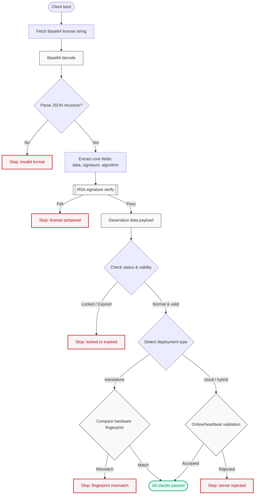

# License Structure & Validation (Client Essentials)

The system issues licenses as **Base64-encoded JSON strings**. During startup the client must decode the string and run through signature verification, hardware fingerprint checks, and expiry/status validation. This guide follows a “flow → structure → payload → example → checklist” order for quick reference.

## 1. Startup Flow Overview

Begin with the big picture: the following Mermaid diagram outlines each validation checkpoint after the client receives a license string, including all failure exits.



## 2. Top-Level License Structure

Once the Base64 string is decoded you will get a JSON object containing three core fields. The structure keeps the payload human-readable while protecting integrity through an asymmetrical signature.

### Field reference

| Field | Type | Description |
| :--- | :--- | :--- |
| `algorithm` | String | Algorithm used to generate the signature, for example `RSA-PSS-SHA256`. |
| `data` | String | **Primary payload** serialized as a JSON string. Contains all enforcement rules, time limits, and fingerprint bindings. |
| `signature` | String | Base64 signature generated from the `data` field. Clients must verify it with the embedded public key before trusting the payload. |

-----

## 3. `data` Payload Details

The `data` field carries every parameter that governs runtime behavior. After deserializing the string, reference the values below to decide how the software should run.

### Core parameters

| Parameter | Values / Type | Description & engineering tips |
| :--- | :--- | :--- |
| `status` | `normal`, `locked`, `expired` | Overall authorization state. **normal** allows execution, **locked** indicates an admin-enforced block, **expired** means the time window has passed. |
| `deployment_type` | `standalone`, `cloud`, `hybrid` | Determines the validation path: standalone = local fingerprint only; cloud = mandatory online heartbeat; hybrid = prefer online, allow short offline grace period. |
| `start_date` / `end_date` | ISO 8601 timestamp | Validity window for the license. Compare against system time during startup; treat any `end_date` in the past as expired. |
| `hardware_fingerprint` | String | Combination of hardware identifiers (MAC/CPU/HostID, etc.). Recalculate locally and compare; mismatch implies unauthorized copy. |
| `usage_limits` | Object | Usage quotas (API calls, seat counts, etc.). |
| `feature_config` | Object | Key-value feature switches controlling which modules (Basic vs Pro) the client may enable. |
| `license_key` | String | Unique identifier for the licensed device; use for logging and backend correlation. |

-----

## 4. Decoded Example

Here is a decoded license sample to highlight formatting and field expectations:

```json
{
  "algorithm": "RSA-PSS-SHA256",
  "data": "{\"activated_at\":\"2025-11-01T22:30:02...\",\"status\":\"normal\",\"deployment_type\":\"standalone\",\"hardware_fingerprint\":\"MAC:5e:a3...\",\"end_date\":\"3025-03-03T23:59:59+08:00\", ...}",
  "signature": "MQDlxx/crzncJfw2Y00X5spzN1bPWKuU4IDxB48Mwy1WMhOoYUDCcrYjiMgNJHsXzUSD14MURqCBKBMgQAc7EOiUUcwfJ1mhSGvbFYnrSGFxjpbEHUg6dJlgSB4jSxwh4jtHSOb82SvPkHrNE0/p/HKN2Vr3Dj2qU0JB7hM2Jd0vb3Tk7WiFWd9as3vvAChhzoXqHo53vtY7ZyUb56VM/M4UMwJ4w4S7M3DZiPwAAobOn1MfOmOnchXzc+lkhC9c67xprmOi33ms775Dc0tNurv+rCLTQN8wgnt5dfhmdyMbsIk2c188IK/7uca2Pi3qaBKSIkVkSKN78pI2A6gMYIA=="
}
```

> **Note:** `data` must remain in its original string form when verifying the signature. Only deserialize after the RSA verification succeeds.

-----

## 5. Client Validation Checklist

Use this checklist to implement a hardened validation pipeline:

1. **Decode**: Base64-decode the license string.
2. **Verify signature**: With the built-in public key, run RSA verification against the original `data` string and the provided `signature`. Abort immediately if the signature fails.
3. **Parse payload**: Deserialize `data` into an object.
4. **Evaluate status & timeline**:
   - Require `status === "normal"`.
   - Confirm current time is between `start_date` and `end_date`.
5. **Match environment**:
   - Branch based on `deployment_type`.
   - Standalone: recompute hardware fingerprint and compare with `hardware_fingerprint`.
   - Cloud/Hybrid: perform online heartbeat or fallback strategy.

> Consider implementing the checklist as a modular validation pipeline so additional strategies (SaaS tenant isolation, audit logging, etc.) can be plugged in later.

