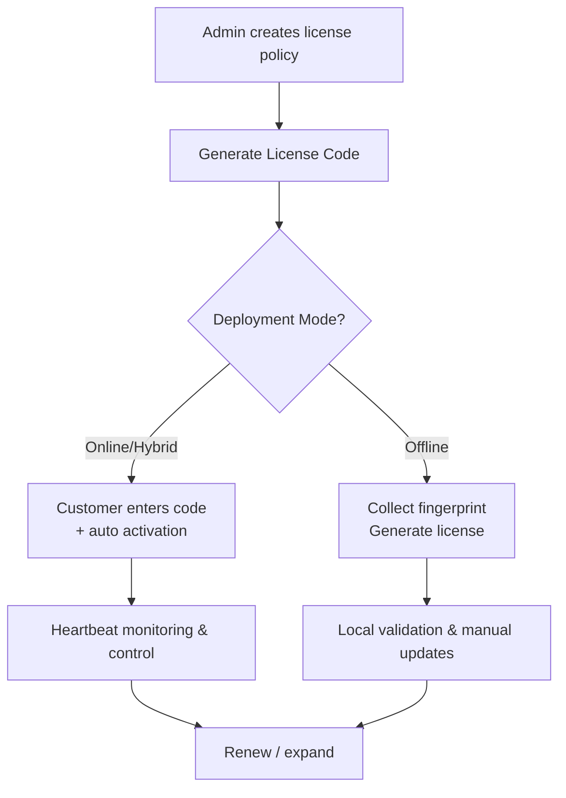
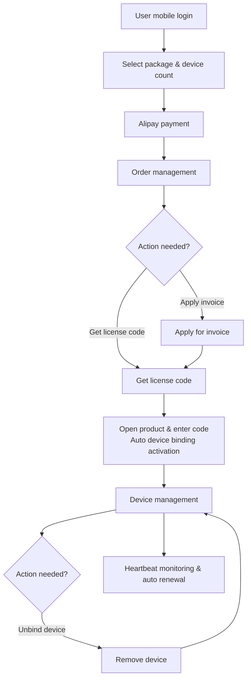

# Operating Guide

## Usage Context

This guide walks through the complete lifecycle of License Manager: “create license → distribute code → customer activation → heartbeat monitoring / renewal”. It targets operations, customer success, and implementation teams so they can master the key actions for online, offline, and hybrid deployments with minimal back-and-forth.

## Terminology Recap

- **License Code**: A unique identifier generated after configuring a license policy in the admin console. It defines validity period, max activations, feature set, and deployment mode.
- **License File / Key**: An encrypted artifact bound to a specific device fingerprint. Clients validate locally with this license during startup.
- **Hardware Fingerprint**: Machine identifiers (MAC, CPU serial, HostID, etc.) collected by the client or manually to prevent cloning.
- **Heartbeat**: Periodic status data reported by online/hybrid clients, enabling remote control, renewals, and auditing.

## End-to-End Flow

License Manager supports two operation flows: traditional B2B flow (for enterprise customers) and user-end self-service flow (for individual users).

### Traditional B2B Flow

1. **Create policy**: Capture customer profile, feature modules, validity, deployment mode, and activation cap.
2. **Distribute code / license**: Share the license code or offline license package depending on deployment mode.
3. **Customer activation**: The client bundles license code + fingerprint to exchange for a license, or loads an offline license directly.
4. **In-life management**: Monitor heartbeats, enforce revocations, trigger renewals, or increase capacity as needed.

### User-End Self-Service Flow

1. **User registration**: Users register and log in via mobile phone number.
2. **Package selection**: Browse available packages and select required feature modules and device quantities.
3. **Payment**: Complete online payment via Alipay.
4. **Order management**: Apply for invoices and obtain corresponding license codes in order management.
5. **Product activation**: Users open the software product, enter the license code, and the system automatically binds the current device fingerprint for activation.
6. **Device management**: View bound devices and unbind unnecessary devices.
7. **Monitoring**: System monitors device status through heartbeat mechanism and supports automatic renewal.

## Business Scenarios

### Scenario 1: 7-day trial, customer deploys 100 servers (online mode)

1. Create a license code with validity of 7 days, max activations 100, deployment mode “Online/Cloud”, and enable the trial feature set.
2. Share the code (e.g., `LIC-2266-EtgAHCyh8HJT-hTAA`) and instruct the customer to place it in the required directory or config file.
3. When the first server boots, the client reads the code and local fingerprint, then calls the REST API. The platform returns a license bound to that server.
4. The admin console shows “Activation progress 1/100” and records the fingerprint plus last seen time.
5. The 100th server repeats the same flow, bringing activation progress to 100/100. Any 101st activation attempt is rejected.
6. After 7 days the local validation fails, a renewal prompt appears, and operators can extend the validity or switch to a paid package.

> **Tip**: Enable heartbeat alerts in online mode to capture usage signals during the trial window and surface upsell opportunities.

### Scenario 2: Offline deployment, single server with perpetual license

1. Create a license code with validity “Perpetual”, max activations 2, deployment mode “Offline”, and enable the contracted feature set.
2. Use a script or the License Manager offline collector to capture the server’s fingerprint and confirm accuracy with the customer.
3. In the console, open the “Offline License” workflow, select the license code, input the fingerprint, and download the generated license file.
4. Deliver the license to the customer so they can place it in the required directory (config folder, system variable, etc.).
5. The product now validates locally. If hardware changes, collect the new fingerprint and regenerate the license.

> **Tip**: Because offline mode cannot detect device changes, outline the fingerprint change process in the contract to discourage unapproved transfers.

### Scenario 3: Trial expires and the customer renews for one year (online / hybrid)

1. Locate the customer’s trial license, update validity from “7 days” to “1 year”, and adjust features or activation caps if needed.
2. After saving, the system marks the license as “Pending Sync” and includes an update flag in the next heartbeat response.
3. The client sees the update signal, automatically downloads the refreshed license parameters, and the expiry extends immediately by one year.
4. If the client stays offline, export the new license manually and guide the customer through a local replacement.

> **Tip**: After renewals or expansions, remind customers to trigger a “re-validate” action (restart service or run a refresh command) so the new policy applies.

## FAQ and Best Practices

- **Activation limit reached**: In “Customer Details → Activated Devices”, release inactive devices or raise the activation cap.
- **Heartbeat timeout**: Ensure the client can reach the License Manager API endpoint; allow the domain/port on gateways or proxies.
- **Fingerprint changes**: Use multi-factor fingerprints (MAC + CPU + HostID) and enable “fingerprint similarity” rules to avoid reissuing due to a single component swap.
- **Offline updates**: Prepare an “offline update bundle” with the license, client SDK, and config templates to minimize manual copy errors.

Following these steps lets you deliver, monitor, and renew licenses efficiently across diverse customer environments—maximizing the value of License Manager’s lifecycle management capabilities.

