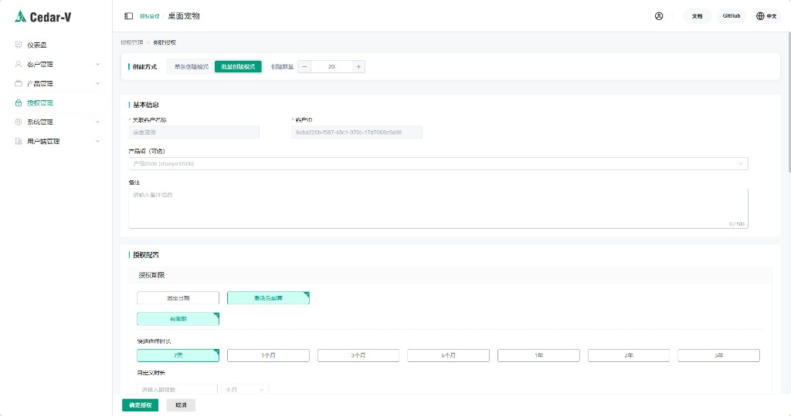

# 客户案例：独立开发者如何更顺畅地销售软件

## 背景

对于独立开发者来说，真正麻烦的往往不是开发软件，而是怎么把软件稳定地卖出去。只有销售链路顺起来，开发者才能持续获得收入，把时间和精力再投入到功能迭代、问题修复和长期维护上，形成更健康的正向循环。

尤其是插件、脚本工具、桌面小工具这类产品，常见分发方式本来就比较分散：有人放在论坛，有人放在交流群，有人放在 B 站视频简介，还有人接入第三方发卡平台。软件能传播出去不是问题，问题在于付费、交付、激活这一段如果靠手工处理，效率很低，也很难管理。

这类场景通常会有几个共同需求：

- 用户付款后，能够自动拿到授权码
- 软件启动后，可以直接校验授权状态
- 授权码能够限制设备数量，避免被随意转发后反复使用
- 授权策略尽量灵活，方便做月卡、年卡、一次性授权等不同商品

---

## 接入方式

License Manager SDK 对接成本比较低，客户端只需要在启动时做一次授权校验：

```python
from license_manager import LicenseClient

client = LicenseClient(
    server_url="https://api.lm.cedar-v.com",
    api_key="your_api_key",
    product_id="your_product_id"
)

result = client.validate()
if not result.valid:
    show_activation_dialog()
```

SDK 会自动处理一部分基础流程，包括：

- 公钥下载
- 许可证下载
- 许可证解析与校验
- 未激活时的激活流程
- 设备绑定与基础授权校验

对独立开发者来说，这样的好处很直接：不用自己再单独处理授权文件、签名校验、设备绑定这些细节。

---

## 授权策略

在这类销售场景里，授权策略通常不需要设计得很复杂，但需要足够实用。

例如，系统支持**从激活时开始计算授权有效期**。对于通过论坛、视频简介或发卡平台分发的软件，这种能力会更方便一些：授权码可以提前生成，但有效期从用户实际激活时开始计算。

此外，系统也支持**批量创建授权码**，适合一次性生成一批商品码，再导入到发卡平台或由运营人员统一分发。



---

## 搭配发卡平台使用

如果开发者不想自己做支付页和自动发货页，可以直接把 License Manager 和第三方发卡平台配合使用。

| 环节 | 工具 | 作用 |
|---|---|---|
| 授权管理 | License Manager | 创建授权码、管理授权策略、控制可激活设备数 |
| 商品销售 | 发卡平台 | 展示商品、接入支付、自动发放授权码 |
| 客户端校验 | License Manager SDK | 校验授权状态、处理激活、绑定设备 |

常见流程如下：

1. 在 License Manager 后台创建产品和授权码
2. 将授权码批量导入发卡平台
3. 用户付款后，发卡平台自动把授权码发给用户
4. 用户在软件中输入授权码完成激活

这样做的价值不在于把流程包装得多复杂，而是在于把原本分散的销售、发码、激活流程串起来，让独立开发者可以更稳定地交付软件商品。

---

## 适用场景

这种方式比较适合以下产品：

- 游戏插件或整合包
- 桌面工具
- 效率类小软件
- 行业专用辅助工具
- 通过社群、内容平台或发卡平台销售的轻量软件

如果产品本身客单价不高，但分发链路比较长、用户来源比较分散，那么这类授权管理方式通常比手工发码更省事，也更容易长期维护。