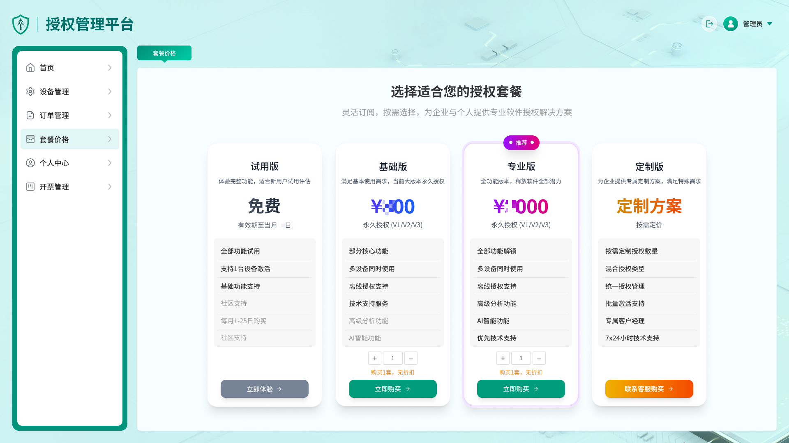
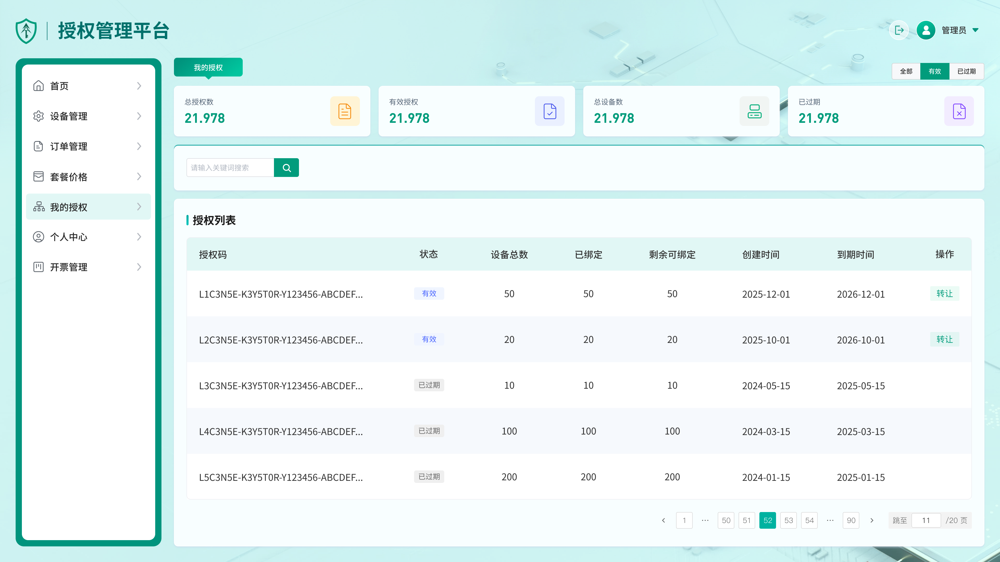
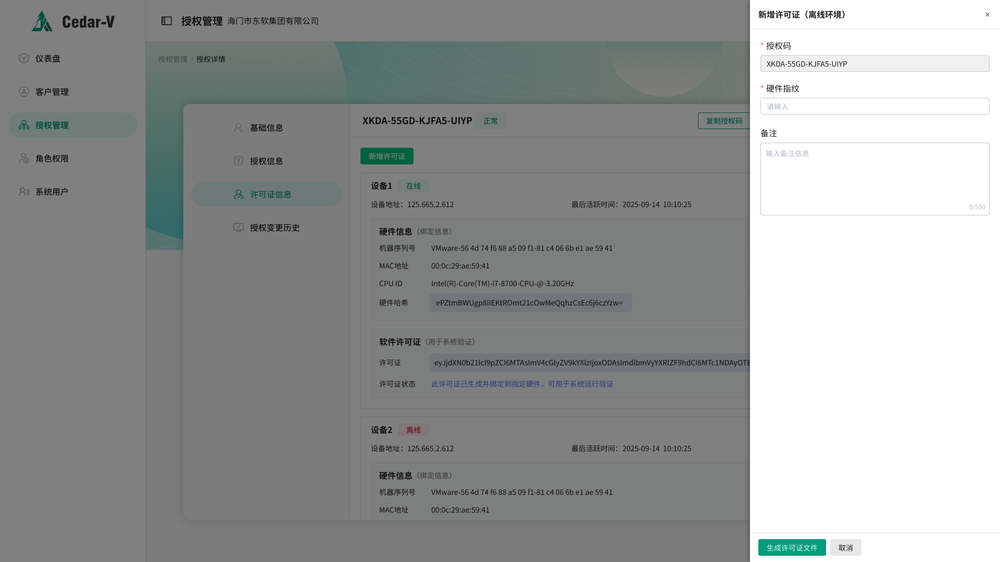
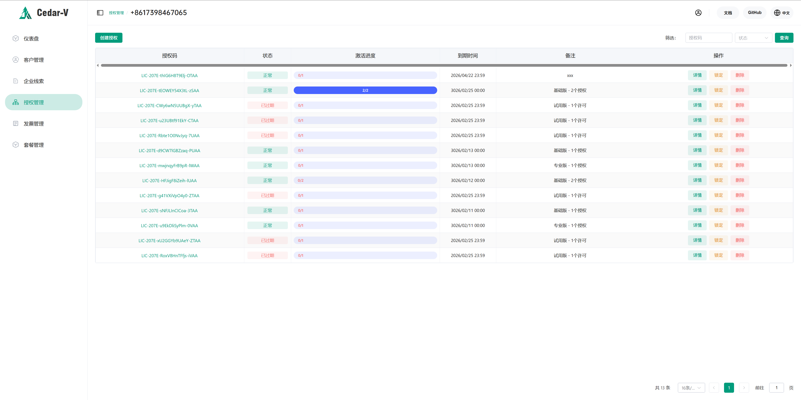
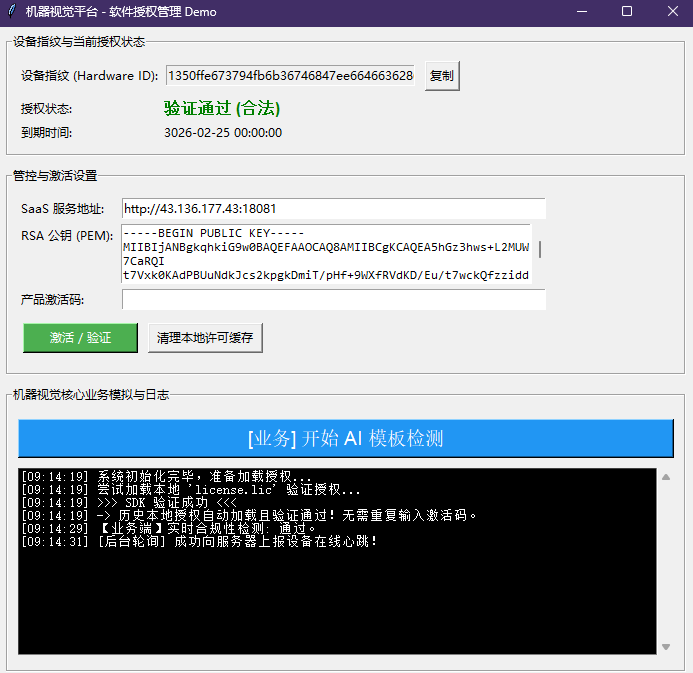

# 客户案例：机器视觉检测软件的灵活授权方案

## 客户背景
客户研发了一款基于深度学习技术的高性能机器视觉应用软件。该软件专为工业制造场景设计，能够准确识别工件表面的细小划痕、斑点，并精确检测工件的形态和轮廓缺陷，可有效克服复杂纹理、毛刺、颜色和各种噪点的干扰。此外，产品内置了 VM 算法开发平台，提供图像分割、分类、模板检测、字符定位与识别、异常检测等算法模块，支持独立训练工具以高效完成打标和训练。

**商业模式：** 
- 软件单设备许可售价约为* 00 元，定价亲民。
- 由于现代工业环境大部分已经实现联网，且目标客户群体（工厂、集成商等）大多具有付费能力，客户希望通过极具吸引力的“免费体验”策略来进行广泛的产品线宣传。
- 同时客户希望建立一套完整的生态，通过自服务的 **SaaS 授权管理平台**，直接完成交易、授权发放、设备分配甚至额度流转功能。
- 

## 核心需求与业务痛点
1. **具有时效性的免费下载试用**：允许用户免费下载获取试用**产品激活码**，但该验证仅限定在每个月的固定时间范围之间才能被验证使用。
2. **多终端授权统管与自助解绑机制**：
   - 用户在 SaaS 用户端可以直接线上购买**产品激活码**，**一个产品激活码可包含多个设备数量许可**。
   - 可以在规定的终端许可数量内激活不同机台。对于已激活的设备，**若绑定时间不满 3 个月，允许用户在客户端/SaaS端自助解绑以更换老旧机器**；若绑定超过 3 个月，强制转入人工审计，必须联系官方客服解绑。
   - 未使用的授权额度甚至 **可以由用户转让给其他用户**，这一特性变相也成为了一种社交化裂变宣传的方式。

3. **彻底的断网可用性支持 (Offline Side-loading)**：
   - 工业环境中存在纯隔离内网，客户需要**即便在完全不联网的机器上也能立即使用产品激活码**完成试用和投产。
   - **巧妙的离线鉴权设计**：用户在管理平台拿到的是包含授权与鉴权的**产品激活码**。对于无网环境，激活码采用特殊格式：在纯授权码后拼接 `&` 及一个 Base64 编码的签名数据（即鉴权信息：完整的许可证 Envelope），形如：
     `LIC-207E-tEOWEY54X3tL-zSAA&eyJhbGdv...`
   - 当终端软件完全无法联网进行 `Activate` 获取凭证时，要求软件能自动截取 `&` 后的鉴权信息，当作合法的离线许可证，直接通过公钥鉴权放行。

4. **一旦联网即刻校验的混合模型**：优先保证离线可用；但**一旦侦测到设备联网，就必须立刻触发在线激活和心跳上报机制**。如果服务端判定该激活状态存在异常（如已被官方封禁、吊销、超出装机数），需强制清除本地 授权并要求重新输入新的**产品激活码**。
5. **轻量接入（业务侵入低）**：客户原业务流程为：“程序打开后调用一次授权检测（返回 OK/NG及对应信息），然后程序内设有一个独立线程，每隔 10/30 分钟做一次授权检测。程序里支持输入**产品激活码**执行在线/离线激活。”客户希望这套机制不仅能被满足，还要开发门槛极低。

## 解决方案设计
基于 `license-manager-sdk` 及配合 SaaS 管理端，我们为客户设计了无缝接入的如下体系：

1. **时效及并发管控交由平台**：利用 License Manager 服务端后台，可以轻松发行为“一码多端”赋能的带有指定有效期的复合**产品激活码**，且配合解绑策略 API 完美实现 3 个月审计风控。

3. **“开箱即用”的高级功能封装**：
   - **指纹绑定防篡改**：SDK 内建的 `HardwareProvider` 会自动提取设备指纹（MAC/CPU/内存），在线下发许可证或离线颁发时均强制与该硬件绑定，阻断倒卖。
   - **灵活的脱机解析 (Offline Side-loading)**：对于含有 `&` 和离线数据的后缀，开发者仅需在获取到用户输入字符串时做一个简单的 `split("&")`。如果存在第二部分，则直接将其传入 SDK 存储层 `Store.save(data)` 落盘。后续直接调用 `Validate`，SDK 内部无状态的 RSA `Validator` 即刻放行，从而在**物理网线拔除的状态下，软件也能顺利投产**。
4. **“先离线侧载，一旦联网则握手对齐”与混合心跳策略 (Client Facade)**：
   - **启动阶段**：无论前置条件如何，调用 `NewClient` 加密恢复本地缓存并尝试 `Validate`。如果是通过 `&` 方式侧载进去的凭据，这一步将秒解脱机痛点。
   - **后台轮询与联网嗅探**：对于“每隔 10/30 分钟轮询”的任务，初始化 `Client` 时启动 SDK 防阻塞心跳即可。当机器意外接入互联网时，心跳请求将送达服务端。如果此时服务端审查出该离线证存在套用、超额、甚至违规转让的情况，服务将拒绝心跳并下达指令。
5. **状态回调与异常自清理机制 (Callbacks)**：
   - 利用 `on_activation_required` 钩子，当后台心跳侦测到服务端因为状态异常拒绝提供新票据时，钩子实时触发。客户只需在此处弹出一个悬浮窗，清除主界面逻辑即可，形成从脱机到联网的完美威慑闭环。

## 实施过程示例

基于新增的纯离线后缀导入要求，客户的初始化代码（Python 版示意）只需添加极少量几行处理逻辑即可兼容两大场景

对接代码省略...

## 客户反馈
客户研发负责人在发版后给出了极高的评价：
> "接入 SDK 之后，一码多端和用户自助解绑这两块省了我们不少精力。以前设备换绑都得人工处理，现在 3 个月内用户自己就能搞定，客服压力明显小了。离线那块也符合预期，工厂的机器不用提报机器码、等我们手动发证，直接粘贴激活码就能跑，现场交付快了很多。"

## 设计哲学与防破解的现实主义思考 (深度剖析)
面对这样一个允许“脱机鉴权”又允许“白嫖试用”、定价仅为数元左右的混合验证方案，很多开发者第一直觉是：**“如果有人永远彻底断网运行这个软件，然后伪造机器特征去刷带 `&` 的激活码包，它防得住百分百的破解和白嫖吗？”**

答案是防不住绝对的黑客，但**在此业务场景下，这正是客户极其高明且克制的架构考量，它完全契合实际的工业化商业运作逻辑：**

1. **绝对离线环境在当代工业界的假象化**：
   - 绝大多数工厂的机台，尤其是应用机器视觉这种需要上传质检报表并与 MES (制造执行系统) / ERP 打通的机器，**必然要连接厂内局域网或外部专网**。
   - 这意味着设备长期处于“绝对物理隔离且无网”的概率越来越低。一旦联网，心跳钩子会在几分钟内抓取异常许可并锁定。
2. **“防君子不防小人”的用户心理博弈**：
   - 企业级用户（特别是工厂买办和系统集成商）的心理是：只要官方给出一个清晰、名正言顺的购买和核查渠道，且价格（300元）远低于找破解版所承担的法律风险、版本维护成本和潜在勒索病毒风险，绝大多数企业极度乐于花这笔“小财”买个官方的正品安心。
   - 商业软件保护的终极目的**从来不是杜绝所有逆向工程，而是极大地提高白嫖的门槛和心理成本**，促使 95% 以上具备支付能力的人觉得“花 300 块钱买个合法授权和转让自由，比到处找断网机刷盗版划算太多了”。
3. **“漏洞”本身就是极佳的病毒式营销**：
   - 客户这种带有转让属性、时效性的策略，在某种程度上甚至是“刻意留有余地”。小规模的破解者或是教育机即便破解了不联网使用，反而极大增加了该软件在算法工程师和底层工区内的市占率和习惯依赖。
   - 一旦这些人走上带有大规模生产网络的成熟产线接下商业订单，他们最先采购的，必然是此时用得最顺手的正版授权。

## 总结
此机器视觉案例充分证实了采用 SDK 与 License Manger 系统组合带来的威力：它不仅实现了精细至季度的设备生命周期管控，更是实现了对线下物理隔离场景的前卫处理。通过巧妙拼接带签名的包围体，充分运用 SDK 本地的 RSA Validator 来达到无需任何多重校验的离线“秒放行”，为工业场景的软件授权探索出了低侵入但高防范的实施样板。真正做到了以商业效率为先导，而非陷入无效“自嗨式反破解”的泥潭。