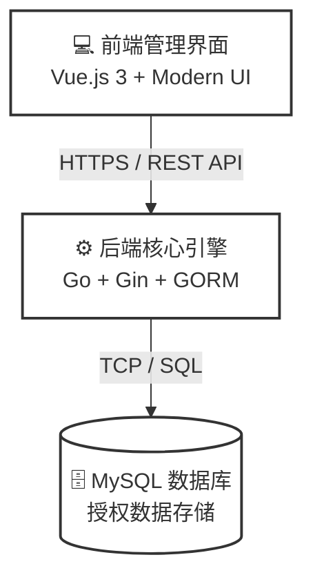
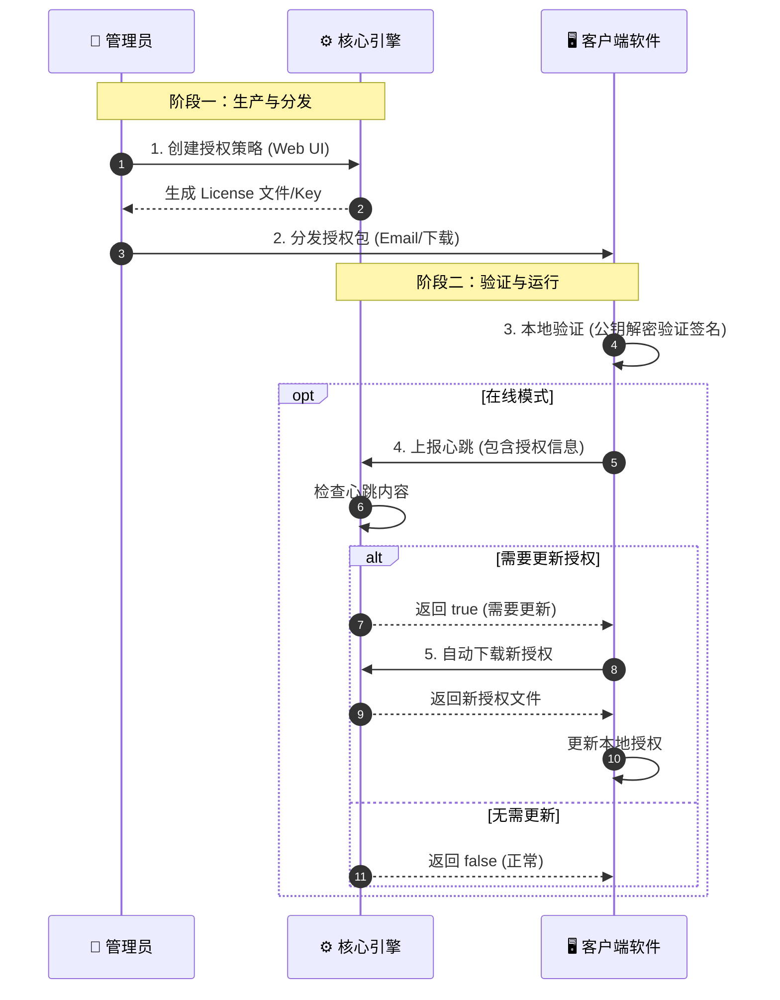

# 介绍

软件授权管理平台是一个独立的软件授权管理系统，为软件系统提供授权码生成、分发、验证和管理服务。系统同时支持企业级管理后台和用户端自助服务，支持在线和离线两种授权模式，基于硬件绑定的授权机制确保安全性。

## 系统概述

License Manager 是一个企业级的软件授权管理解决方案，提供双端服务模式：

- **企业端**：帮助软件厂商实现从授权生成、分发、验证到全生命周期管理的完整闭环
- **用户端**：为终端用户提供自助购买、激活、管理授权的便捷服务，支持手机号注册、在线支付、设备绑定等功能

系统采用前后端分离架构，提供直观的管理界面和丰富的 API 接口，支持多种部署模式，满足不同场景下的授权管理需求。

## 核心特性

### 🔐 灵活的授权模式

- **在线授权（Cloud）**：本地验证 + 心跳上报，支持远程控制和管理
- **离线授权（Standalone）**：基于硬件指纹绑定，无需联网即可验证
- **混合模式（Hybrid）**：本地验证 + 心跳上报，断网时允许短时间离线运行

### 🛡️ 安全机制

- **硬件绑定**：通过设备指纹（MAC、CPU、HostID等）防止授权复制
- **数字签名**：RSA-PSS-SHA256 签名确保授权数据完整性
- **状态管理**：支持正常、锁定、过期等多种状态，可远程控制授权
- **密钥加密**：授权数据加密存储和传输

### 📊 全生命周期管理

- **客户管理**：客户档案、联系人、授权关系统一维护
- **授权生成**：批量生成、自定义有效期、功能限制配置
- **状态监控**：实时查看授权状态、使用统计
- **操作审计**：完整的操作日志记录，便于追溯和审计

### 👤 用户自助服务

- **自助购买**：用户通过手机号注册登录，选择套餐和设备数量，支付宝在线支付
- **一键激活**：获取授权码后打开软件产品输入授权码，系统自动绑定设备并激活
- **订单管理**：支持查看订单历史、申请开发票等服务
- **设备管理**：支持查看已绑定设备、解绑不需要的设备
- **自动续费**：支持心跳监控和自动续费提醒

### 🚀 易于集成

- **RESTful API**：标准化的 API 接口，易于与现有系统集成
- **客户端 SDK**：提供多种语言的客户端验证库
- **部署包生成**：自动生成包含配置的部署包，简化交付流程

## 系统架构

系统采用现代化的**前后端分离架构**设计，后端基于高性能的 **Go (Golang)** 语言构建。这种架构设计既保证了系统在高并发场景下的稳定性，又极大地简化了企业的部署与运维成本。

### 核心组件

### 架构优势

  * **极致性能**：得益于 Go 语言的协程（Goroutine）特性，单节点即可支撑数万级并发验证请求，资源占用极低。
  * **部署简便**：后端编译为单一二进制文件（Single Binary），无复杂的运行时依赖（Zero Dependency），完美支持 Docker 容器化部署。
  * **安全可靠**：API 接口层采用严格的鉴权机制，核心业务逻辑在服务端闭环，数据库支持事务一致性保障。
  * **易于扩展**：模块化的代码结构设计，支持从单机模式平滑升级至集群高可用模式。

### 工作流程

1.  **授权生成 (Issuance)**：管理员通过前端界面配置策略，后端核心引擎结合加密算法生成防篡改的授权许可证（License File/Key）。
2.  **授权分发 (Distribution)**：支持在线自动分发或导出离线部署包，通过安全通道交付给最终用户。
3.  **端侧验证 (Verification)**：客户端应用集成 SDK，在启动或运行时进行**本地验证**（使用公钥解密验证签名）。无论是在线模式还是离线模式，验证都在本地完成，无需实时联网。
4.  **心跳上报与授权更新 (Heartbeat & Update)**：在线模式下，客户端会定期向服务端上报心跳（包含授权信息）。服务端检查心跳内容，判断是否需要更新授权。如需更新，返回 `true` 给客户端，客户端自动下载新授权并更新本地授权文件。
5.  **审计与监控 (Audit)**：系统自动记录验证日志与心跳数据，实时反馈授权使用状态与异常告警。

## 适用场景

- **SaaS 软件**：需要按时间、功能、用户数等维度控制访问权限
- **企业软件**：需要硬件绑定，防止授权被非法复制
- **嵌入式系统**：需要离线验证，不依赖网络连接
- **API 服务**：需要控制调用次数、并发数等使用量限制
- **软件试用**：提供试用期授权，到期后自动限制功能
- **个人用户软件**：支持用户自助购买、在线支付、设备绑定激活
- **多设备管理**：支持单个用户在多台设备上使用，支持设备解绑和重新分配

## 下一步

- 如果您是**新用户**，建议从 [快速开始](./getting-started.md) 开始，了解如何部署系统
- 如果您想了解**为什么需要授权系统**，可以查看 [商业价值](./business_value.md)
- 如果您是**开发人员**，需要集成授权验证，请参考 [许可证结构](./license-token-structure.md) 和 [API 文档](./api.md)
- 如果您想**参与贡献**或了解我们的发展理念，可以查看 [社区发展策略](./community_strategy.md)
