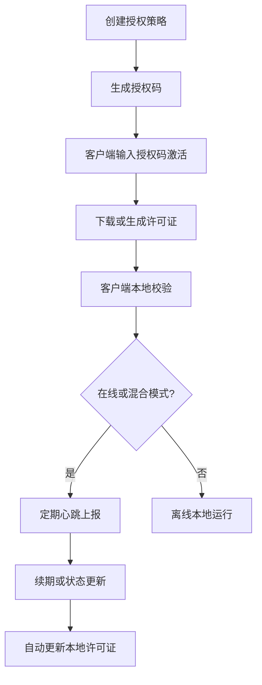

# 介绍

License Manager 是一个面向软件厂商、实施团队和独立开发者的软件授权管理系统，用来管理**授权码生成、许可证下发、客户端验证、续期更新和运行期控制**等关键环节。

对很多软件团队来说，难点并不只是“如何做一次授权校验”，而是如何把**发码、激活、设备绑定、续期、离线交付、运行期管理**这些环节串成一条稳定的交付链路。License Manager 的定位，就是把这些能力集中起来，避免在每个项目里重复造轮子。

## 这套系统解决什么问题

如果您的软件需要对交付对象、授权时长、设备数量或功能范围做控制，通常会遇到下面这些问题：

- 授权规则分散在客户端代码里，后续调整成本高
- 软件已经交付，但缺少统一的发码、激活和续期机制
- 客户环境复杂，既有可联网场景，也有完全离线场景
- 需要限制设备数量，或将授权与具体机器绑定
- 需要在不重新发版的情况下调整授权状态或有效期

License Manager 主要就是围绕这些问题提供一套可落地的管理方式。

## 核心能力

### 授权码与许可证管理

系统支持围绕产品创建授权码，并根据策略生成与分发许可证。

- 支持设置有效期、激活数量、功能范围等授权策略
- 支持批量创建授权码，便于统一导入或批量交付
- 支持根据设备信息生成许可证，用于正式授权交付
- 支持调整授权状态，例如正常、锁定、过期等

### 在线、离线与混合部署

系统支持不同部署模式，适配实际客户环境。

- **在线模式（Cloud）**：客户端本地校验 + 服务端心跳，适合需要远程续期、状态同步和运行期控制的场景
- **离线模式（Standalone）**：许可证绑定设备，本地完成验证，适合内网、工控或隔离环境
- **混合模式（Hybrid）**：优先走在线流程，同时保留一定的离线运行能力，兼顾控制力和可用性

### 客户端本地验证

客户端在运行时并不依赖“每次联网实时鉴权”，而是基于本地许可证完成核心校验。

- 许可证采用签名保护，客户端可使用公钥完成验签
- 可结合硬件指纹（Hardware Fingerprint）做设备绑定
- 可根据许可证内容判断状态、有效期、功能配置和使用限制
- 即使是在线场景，核心放行逻辑仍然可以在本地完成

### 运行期控制与续期更新

对于在线或混合模式，系统可以在软件运行后继续管理授权状态。

- 客户端可定期上报心跳（Heartbeat）
- 服务端可根据策略判断是否需要更新许可证
- 续费、扩容或状态变更后，客户端可以自动下载新许可证并更新本地状态
- 便于售后、运营或实施团队持续管理已交付软件

### SDK 与集成能力

License Manager 提供客户端 SDK，帮助开发者更快接入授权验证能力。

SDK 已覆盖一组常见基础流程，包括：

- 公钥下载
- 许可证下载
- 许可证解析与验签
- 激活流程处理
- 设备绑定与基础校验

这样做的好处是，开发团队不需要在每个客户端项目中重复实现许可证解析、签名校验和激活逻辑。

## 典型使用场景

### 企业软件交付

面向企业客户交付桌面软件、服务端程序或行业系统时，通常需要按客户、设备数、有效期或功能模块进行授权控制。此时可以通过 License Manager 统一生成授权码、分发许可证并管理后续续期。

### 离线环境授权

如果软件部署在内网、工控机房、生产现场或其他无法联网的环境中，可以采用离线模式：先采集设备指纹，再生成绑定设备的许可证，由客户端在本地完成验证。

### 在线试用与正式续费

如果您希望先提供试用授权，后续再切换为正式授权，可以使用在线或混合模式。客户端在首次激活后运行，后续通过心跳获取续期或授权更新，无需每次都重新人工发放文件。

### 独立开发者软件销售

对于插件、桌面工具、行业小软件这类产品，软件本身可以通过社群、内容平台或发卡平台传播，License Manager 负责承接后面的授权生成、激活和验证环节，让销售链路更容易长期维护。

## 一个简化的工作流程

下图展示了这套系统最常见的工作方式：

```mermaid
flowchart TD
    A[创建授权策略] --> B[生成授权码]
    B --> C[客户端输入授权码激活]
    C --> D[下载或生成许可证]
    D --> E[客户端本地校验]
    E --> F{在线或混合模式?}
    F -->|是| G[定期心跳上报]
    G --> H[续期或状态更新]
    H --> I[自动更新本地许可证]
    F -->|否| J[离线本地运行]
```

在这个流程里：

1. 管理端先定义授权策略
2. 客户端通过授权码完成首次激活
3. 系统根据部署模式下发或生成许可证
4. 客户端基于许可证完成本地验证
5. 在线或混合模式下，后续可通过心跳继续做续期和状态同步

## 适合哪些团队

这套系统比较适合以下类型的团队或产品：

- 需要做商业授权的软件团队
- 需要控制设备激活数量的桌面客户端或边缘软件
- 需要支持离线交付的行业软件、工控软件或嵌入式配套软件
- 需要统一管理试用、正式授权、续费和状态更新的产品团队
- 希望快速接入授权能力，而不是从零实现整套许可证体系的开发团队

## 建议的阅读顺序

如果您是第一次接触 License Manager，建议按下面顺序阅读：

1. 先看 [快速开始](./getting-started.md)，了解系统怎么部署
2. 再看 [操作指南](./operating_guide.md)，理解授权创建、分发、激活和续期流程
3. 如果您需要接入客户端，请继续看 [客户端 SDK](./sdk.md) 和 [许可证结构与验证（客户端要点）](./license-token-structure.md)
4. 如果您希望先体验一遍客户端流程，可以查看 [客户端授权测试工具](./client-simulator.md)
5. 如果您要对接系统接口，请查看 [接口文档](./api.md)

## 相关文档

- [快速开始](./getting-started.md)
- [操作指南](./operating_guide.md)
- [客户端 SDK](./sdk.md)
- [许可证结构与验证（客户端要点）](./license-token-structure.md)
- [客户端授权测试工具](./client-simulator.md)
- [接口文档](./api.md)
- [为什么需要授权管理系统](./why/why-you-need-license-management.md)
- [机器视觉检测软件的灵活授权方案](./cases/machine-vision-licensing.md)
- [独立开发者的即时变现之路](./cases/indie-developer-monetization.md)
