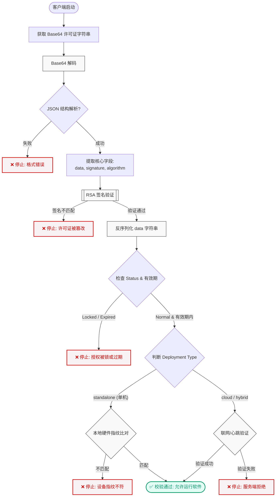

# 许可证结构与验证（客户端要点）

本系统生成的许可证是一个 **Base64 编码的 JSON 对象**。客户端在启动阶段需要解码该字符串，并据此完成授权校验、硬件绑定判定及密钥验签。下方内容按照「流程 → 数据结构 → 示例 → 验证步骤」的顺序组织，便于查阅。

## 1. 启动阶段流程概览

先从整体流程入手：以下 Mermaid 流程图展示了客户端拿到许可证字符串后的关键校验路径，帮助定位每一步需要完成的动作与可能的失败分支。



## 2. 许可证顶层结构

当您对许可证字符串完成 Base64 解码后，将得到一个包含三个核心字段的 JSON 对象。该结构设计确保了数据的可视性（明文数据）与安全性（加密签名）。

### 顶级字段说明

| 字段名 (Field) | 类型 | 说明 |
| :--- | :--- | :--- |
| **`algorithm`** | String | 用于生成签名的加密算法（例如：`RSA-PSS-SHA256`）。 |
| **`data`** | String | **核心授权载体**。这是一个被序列化为字符串的 JSON 对象，包含了具体的授权规则、时间限制和硬件指纹。 |
| **`signature`** | String | 针对 `data` 字段生成的加密签名（Base64 格式）。客户端需使用公钥验证此签名，以确保授权信息未被篡改。 |

-----

## 3. `data` Payload 详解

`data` 字段是许可证的核心载荷。解析该 JSON 字符串后，客户端可获得决定软件行为的全部控制参数。

### 核心参数定义

| 参数名 | 枚举值/类型 | 描述与开发建议 |
| :--- | :--- | :--- |
| **`status`** | `normal` (正常)<br>`locked` (锁定)<br>`expired` (过期) | 当前授权的状态。<br>**开发建议**：<br>• **normal**: 允许软件正常运行。<br>• **locked**: 授权被管理员强制禁用或检测到违规，应立即阻止运行。<br>• **expired**: 授权已过有效期，应阻止运行或降级为受限模式。 |
| **`deployment_type`** | `standalone` (单机版)<br>`cloud` (云端版)<br>`hybrid` (混合版) | 部署模式，决定了验证逻辑：<br>• **standalone**: 仅进行本地硬件指纹比对。<br>• **cloud**: 需联网向授权服务器心跳验证。<br>• **hybrid**: 优先联网，断网时允许短时间本地离线验证。 |
| **`start_date`**<br>**`end_date`** | ISO 8601 时间戳 | 授权的生效与过期时间。<br>**开发建议**：在软件启动时比对当前系统时间。若 `end_date` 小于当前时间，将状态视为过期。 |
| **`hardware_fingerprint`** | String | 绑定的硬件特征组合（如 MAC, CPU, HostID）取决于客户端的实现。<br>**关键步骤**：客户端需重新计算本地硬件指纹，并与此字段比对。若不一致，说明许可证被非法复制。 |
| **`usage_limits`** | Object | 使用量限制（如 API 调用次数，用户数量限制等）。 |
| **`feature_config`** | Object | 功能特性开关（Key-Value）。<br>用于控制软件内特定模块（如 Pro版/基础版）的启用或禁用。 |
| **`license_key`** | String | 设备的唯一授权标识符。<br>用于日志记录或作为与后端通讯的凭证。 |

-----

## 4. 解码示例

以下示例展示了解码后的标准许可证对象，便于对字段含义与格式建立直观印象：

```json
{
  "algorithm": "RSA-PSS-SHA256",
  "data": "{\"activated_at\":\"2025-11-01T22:30:02...\",\"status\":\"normal\",\"deployment_type\":\"standalone\",\"hardware_fingerprint\":\"MAC:5e:a3...\",\"end_date\":\"3025-03-03T23:59:59+08:00\", ...}",
  "signature": "MQDlxx/crzncJfw2Y00X5spzN1bPWKuU4IDxB48Mwy1WMhOoYUDCcrYjiMgNJHsXzUSD14MURqCBKBMgQAc7EOiUUcwfJ1mhSGvbFYnrSGFxjpbEHUg6dJlgSB4jSxwh4jtHSOb82SvPkHrNE0/p/HKN2Vr3Dj2qU0JB7hM2Jd0vb3Tk7WiFWd9as3vvAChhzoXqHo53vtY7ZyUb56VM/M4UMwJ4w4S7M3DZiPwAAobOn1MfOmOnchXzc+lkhC9c67xprmOi33ms775Dc0tNurv+rCLTQN8wgnt5dfhmdyMbsIk2c188IK/7uca2Pi3qaBKSIkVkSKN78pI2A6gMYIA=="
}
```

> **注意：** `data` 字段在传输过程中是**字符串格式**。验证签名时必须使用原始的 `data` 字符串，只有在读取配置时才将其反序列化为 JSON 对象。

-----

## 5. 客户端验证清单

为了保证软件的安全性和授权的有效性，建议客户端按照以下步骤执行校验：

1.  **解码 (Decode):** 将许可证字符串进行 Base64 解码。
2.  **验签 (Verify Signature):** 使用内置的**公钥 (Public Key)**，对 `data` 字符串和 `signature` 进行 RSA 校验。
      * *若验签失败，说明许可证被篡改，应立即终止程序。*
3.  **解析 (Parse):** 将 `data` 字符串反序列化为对象。
4.  **状态检查 (Check Status):**
      * 确认 `status` 等于 `"normal"`。
      * 确认当前时间在 `start_date` 和 `end_date` 之间。
5.  **环境指纹比对 (Fingerprint Match):**
      * 根据 `deployment_type` 执行相应的硬件或网络校验。
      * (单机版) 重新计算本地硬件信息并与 `data` 中的 `hardware_fingerprint` 进行比对。

> 可以将上述 5 步实现为模块化的校验管线，以便后续扩展（例如增加联网授权、租户隔离等策略）。

