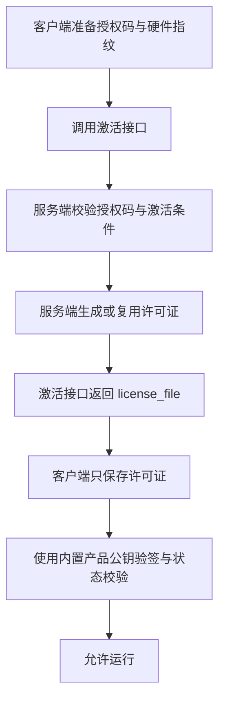

# 许可证结构与验证（客户端要点）

本文档基于当前项目代码中的实际激活流程整理，重点说明**激活接口返回什么、客户端应如何保存和校验许可证、在线与离线模式下分别关注什么**。

先说最关键的一点：**正式客户端应在开发阶段从产品页面获取产品公钥，并把它内置到客户端代码或只读资源中。** 客户端始终使用这把公钥验证许可证，接口响应中的 `public_key` 无需处理。

## 激活流程概览

从客户端视角看，实际流程如下：


```mermaid
flowchart TD
    A[客户端准备授权码与硬件指纹] --> B[调用激活接口]
    B --> C[服务端校验授权码与激活条件]
    C --> D[服务端生成或复用许可证]
    D --> E[激活接口返回 license_file]
    E --> G[客户端只保存许可证]
    G --> H[使用内置产品公钥验签与状态校验]
    H --> I[允许运行]
```

这里有两个操作要点：

- `license_file` 是客户端后续本地校验时真正使用的许可证数据
- 产品公钥是客户端在开发阶段内置的验签信任根
- 响应中的 `public_key` 是兼容字段，客户端无需处理

也就是说，**激活成功后直接使用内置产品公钥验证许可证，通过后保存许可证文件**。

## 激活接口返回结构

根据当前后端 `ActivateResponse` 的定义，激活接口会返回以下字段：

| 字段名 | 类型 | 说明 |
|---|---|---|
| `license_key` | String | 许可证唯一标识，用于后续心跳、日志和服务端查询 |
| `license_file` | String | Base64 编码的许可证内容，客户端需要保存并用于本地校验 |
| `heartbeat_interval` | Int | 心跳间隔，单位秒 |
| `public_key` | String | 兼容字段；使用内置产品公钥接入时无需处理 |

客户端首次激活时需要持久化：

- `license_file`

产品公钥随客户端程序交付，不保存在可由激活响应覆盖的授权数据目录中。

如果系统启用了运行期管理，客户端还需要继续保存：

- `license_key`
- `heartbeat_interval`

## 关于公钥与许可证的关系

您提醒的这一点很关键，必须单独说明。

当前实现是**每个产品拥有固定的产品密钥对，同一产品新签发的许可证共享同一验签公钥**。它不是全平台共用的一把全局公钥，也不是每次激活后由客户端临时信任一把新公钥。

结合代码可以明确两件事：

- 产品创建时生成产品公私钥，产品页面允许开发者获取公钥
- 许可证保存所属产品密钥的副本，以兼容现有签名和响应结构

因此从客户端接入角度，正确理解应该是：

- **同一产品的许可证使用同一产品公钥验签**
- 客户端应在发布前内置产品公钥
- 后续校验许可证时始终使用内置产品公钥

## `license_file` 的顶层结构

`license_file` 本身是一个 **Base64 编码的 JSON 对象**。客户端通常需要先做 Base64 解码，再解析 JSON，并对其中的 `data` 和 `signature` 执行验签。

顶层结构如下：

| 字段名 | 类型 | 说明 |
|---|---|---|
| `algorithm` | String | 当前许可证签名算法，例如 `RSA-PSS-SHA256` |
| `data` | String | 核心授权载荷，是一个被序列化后的 JSON 字符串 |
| `signature` | String | 针对 `data` 生成的签名，客户端必须使用内置产品公钥验证 |

## `data` Payload 说明

解析 `data` 字段后，客户端可以拿到实际授权信息。当前文档中最重要的是下面这些字段：

| 参数名 | 类型/枚举 | 说明 |
|---|---|---|
| `status` | `active` / `revoked` | 当前许可证状态；到期还需结合 `end_date` 判断 |
| `deployment_type` | `standalone` / `cloud` / `hybrid` | 部署模式，决定客户端校验和运行期行为 |
| `start_date` / `end_date` | ISO 8601 时间戳 | 许可证有效期 |
| `hardware_fingerprint` | String | 当前许可证绑定的硬件指纹 |
| `product_code` | String | 签发许可证的产品编码 |
| `feature_config` | Object | 功能开关配置 |
| `usage_limits` | Object | 使用量限制 |
| `license_key` | String | 许可证唯一标识 |

### 关于 `deployment_type`

| 模式 | 客户端关注点 |
|---|---|
| `standalone` | 本地验签 + 本地时间校验 + 本地硬件指纹校验 |
| `cloud` | 本地验签与放行，同时配合服务端心跳完成状态同步、续费和运行期控制 |
| `hybrid` | 正常情况下走在线同步；网络异常时，允许客户端继续依赖本地许可证运行一段时间 |

这里特别强调：**即使是 `cloud` 模式，客户端核心放行逻辑仍然是基于本地许可证完成的，不是每次启动都实时联网鉴权。**

## 解码示意

下面是解码后的许可证对象示意，用来帮助理解结构。它是结构示意，不代表完整字段集合：

```json
{
  "algorithm": "RSA-PSS-SHA256",
  "data": "{\"status\":\"active\",\"deployment_type\":\"cloud\",\"hardware_fingerprint\":\"MAC:5e:a3...\",\"start_date\":\"2026-06-01T00:00:00+08:00\",\"end_date\":\"2027-06-01T00:00:00+08:00\",\"license_key\":\"LIC-DEVICE-XXXX\"}",
  "signature": "BASE64_SIGNATURE"
}
```

> **注意**：验签时应使用原始 `data` 字符串，而不是先反序列化后再重新编码。否则很容易因为序列化细节差异导致验签失败。

## 客户端验证顺序

建议客户端按下面顺序处理：

1. 发布前从产品页面获取产品公钥，并内置到客户端代码或只读资源
2. 调用激活接口，获取 `license_file`、`license_key` 和 `heartbeat_interval`
3. 只持久化可变的 `license_file`，然后做 Base64 解码
4. 解析顶层 JSON，取出 `algorithm`、`data` 和 `signature`
5. 使用内置产品公钥验证 `signature`
6. 验签通过后，再将 `data` 反序列化为对象
7. 检查 `status`、`start_date`、`end_date` 和 `deployment_type`
8. 如果需要设备绑定，再比对 `hardware_fingerprint`
9. 校验通过后允许运行，并按 `heartbeat_interval` 启动心跳

## 运行期更新

对于在线或混合模式，客户端后续通常还会通过心跳接口继续与服务端同步。

运行期需要关注：

- 授权状态是否变更
- 配置是否更新
- 服务端是否返回新的 `license_file`
- 客户端是否需要更新本地许可证

也就是说，激活接口负责“首次拿到许可证”，心跳接口负责“后续同步许可证变化”，产品公钥始终来自客户端发布前内置的固定信任根。

## 对接建议

如果您在实现客户端产品接入，建议遵循以下原则：

- 始终使用客户端内置的产品公钥验证许可证
- 接口响应中的 `public_key` 无需处理
- 只保存可变的 `license_file`
- 将本地验签与业务状态校验拆开，便于排查问题
- 心跳更新到新许可证后仍使用同一内置产品公钥验签

## 相关文档

- [介绍](./index.md)
- [操作指南](./operating_guide.md)
- [AI 原生 API 快速接入（推荐）](/developer/ai-quickstart.md)
- [开发者中心](/developer/)
- [本地许可证校验](/developer/license-validation.md)
- [在线激活](/developer/activation-online.md)
- [客户端授权测试工具](./client-simulator.md)
- [接口文档](./api.md)
- [客户端 SDK（可选）](./sdk.md)
