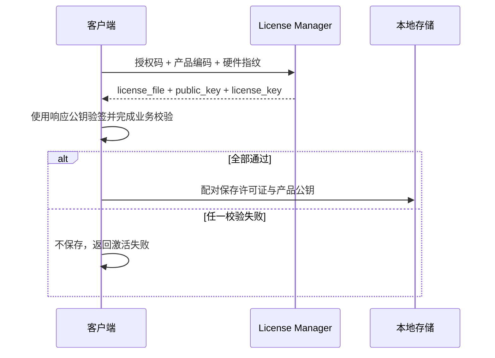

# 许可证结构与验证（客户端事实源）

> 适用版本：License Manager API v1 与官方 SDK
>
> 规则生效：2026-08-18
>
> 本页替代“首次在线激活前必须内置产品公钥”的旧接入说明。

License Manager 使用 RSA 数字签名保护许可证。签名公钥属于**产品级**：同一产品签发的许可证使用该产品对应的公钥验签，而不是每张许可证各有一对密钥。

公钥来源取决于接入方式：

| 场景 | 公钥来源 | 保存与更新规则 |
|------|----------|----------------|
| 首次在线激活、试用或恢复 | 接口与 `license_file` 同时返回的 `public_key` | 使用响应中的公钥验证许可证，完整校验通过后配对保存 |
| 心跳返回新许可证 | 本地已保存的产品公钥 | 验证新许可证，通过后只替换许可证；失败时保留旧许可证 |
| 纯离线导入 | 与许可证同一交付批次提供的产品公钥 | 验证许可证，通过后配对保存 |

预置或钉扎产品公钥可作为高安全场景的增强措施，但不是首次在线激活的必需条件。

## 首次在线获取


```mermaid
sequenceDiagram
    participant Client as 客户端
    participant API as License Manager
    participant Store as 本地存储
    Client->>API: 授权码 + 产品编码 + 硬件指纹
    API-->>Client: license_file + public_key + license_key
    Client->>Client: 使用响应公钥验签并完成业务校验
    alt 全部通过
        Client->>Store: 配对保存许可证与产品公钥
    else 任一校验失败
        Client->>Client: 不保存，返回激活失败
    end
```

关键响应字段：

| 字段 | 含义 | 客户端责任 |
|------|------|------------|
| `license_file` | Base64 编码的许可证文件 | 解码、解析、验签并完成业务校验 |
| `public_key` | 当前产品的 RSA 公钥（PEM） | 验证同次响应中的许可证，并与许可证配对保存 |
| `license_key` | 许可证密钥 | 用于后续心跳或服务端查询 |
| `heartbeat_interval` | 建议心跳间隔，单位秒 | 按服务端值安排心跳，不在客户端写死 |

不要先保存再验证。只有签名、状态、有效期、设备指纹等检查全部通过，才能更新本地可信状态。

## 产品、公钥与许可证的关系

- 一个产品配置一对 RSA 签名密钥。
- 服务端使用产品私钥签发该产品下的许可证。
- 客户端只持有产品公钥，不能持有服务端私钥。
- 同一产品下的多张许可证可以使用同一个产品公钥验签。
- 不同产品的许可证和公钥不能混用。

`public_key` 是产品级信任材料，`license_file` 是面向具体授权和设备生成的许可证载荷。客户端应记录两者的配对关系，避免跨产品使用。

## 许可证文件结构

`license_file` 经 Base64 解码后是许可证信封，顶层包含：

| 字段 | 类型 | 说明 |
|------|------|------|
| `algorithm` | String | 当前签名算法，例如 `RSA-PSS-SHA256` |
| `data` | String | 原始授权载荷 JSON 字符串 |
| `signature` | String | 针对 `data` 原始 UTF-8 字节生成的签名 |

`data` 载荷通常包含许可证标识、产品信息、授权状态、生效和到期时间、硬件指纹、功能配置、用量限制与自定义参数。具体字段随许可证类型和产品配置变化。

验签时必须使用原始 `data` 字符串，不能先反序列化再重新序列化，否则可能改变字节内容并导致验签失败。

## 完整校验顺序

每次加载或更新许可证时按以下顺序处理：

1. 确定与许可证配对的产品公钥。
2. Base64 解码并解析许可证信封。
3. 检查 `algorithm` 是否为客户端支持的算法。
4. 使用产品公钥验证 `signature`。
5. 验签通过后再解析 `data`。
6. 检查许可证状态、生效时间、到期时间及允许的时钟偏差。
7. 检查硬件指纹是否与当前设备匹配。
8. 按产品约定读取功能、额度与自定义授权内容。
9. 所有检查通过后，才允许启用授权功能或替换本地许可证。

签名验证只证明许可证由对应产品签发且内容未被篡改，不能代替状态、时间和硬件绑定等业务校验。

## 心跳返回新许可证

心跳响应可能携带新的 `license_file`，例如授权期限或功能配置发生变化。此时使用本地保存的产品公钥，执行与首次激活后相同的完整校验：

```text
收到新 license_file
→ 使用已保存的产品公钥验签
→ 检查状态、时间、硬件指纹和授权内容
→ 全部通过后原子替换旧许可证
```

心跳不返回新公钥，也不更新本地产品公钥。新许可证校验失败时必须保留旧许可证，不能用失败结果破坏已有可恢复状态。

## 纯离线导入

纯离线设备无法通过接口首次取得公钥，因此交付物至少包含：

- `license_file`；
- 对应产品的 RSA 公钥；
- 必要时用于确认配对关系的产品标识或摘要。

客户端导入这组数据后，执行与在线模式相同的签名、状态、时间和硬件绑定校验。全部通过后，再配对保存许可证与产品公钥。

## 可选的公钥预置与钉扎

对供应链、私有部署或固定信任根有额外要求的产品，可以在客户端发布时预置产品公钥，或保存首次可信获取的公钥摘要并做后续一致性检查。该策略需要由产品安全方案明确启用。

不要把“预置公钥”描述为所有在线接入的前置条件，也不要把在线接口返回的 `public_key` 当作可忽略的兼容字段。

## 相关文档

- [在线激活](/developer/activation-online.md)
- [离线激活](/developer/activation-offline.md)
- [本地许可证校验](/developer/license-validation.md)
- [API 总览](/developer/api/)
- [AI 原生 API 快速接入](/developer/ai-quickstart.md)
