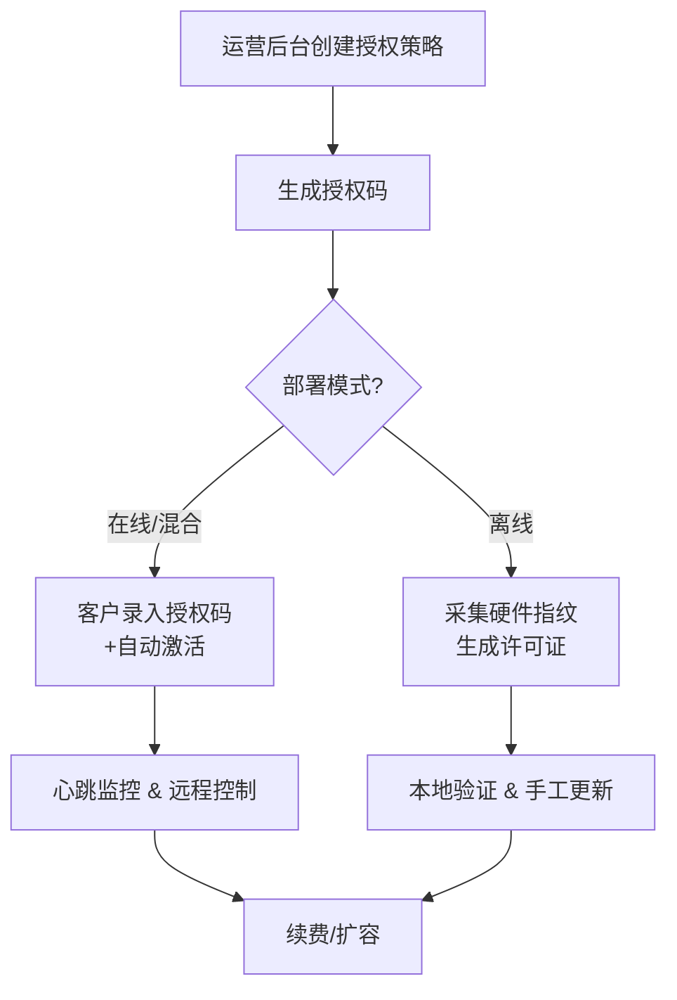
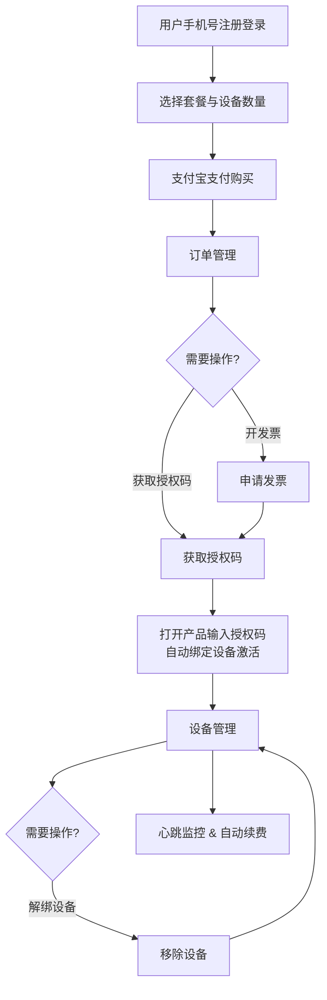

# 操作指南

## 使用背景

操作指南围绕 License Manager 的“创建授权 → 分发授权码 → 客户激活 → 心跳监控/续费”闭环展开。本文面向运营、售后与实施人员，帮助你快速把握不同部署模式（在线 / 离线 / 混合）的操作重点，并降低沟通成本。

## 术语回顾

- **授权码（License Code）**：在管理后台创建授权策略后生成的唯一标识码。它定义了有效期、最大激活设备数、可用功能模块、部署模式等信息。
- **许可证（License File/Key）**：与具体设备硬件指纹绑定的加密文件，客户端在启动时使用许可证进行本地验证。
- **硬件指纹（Hardware Fingerprint）**：客户端上报或人工采集的机器标识（例如 MAC、CPU 序列号、HostID），用于防止许可证被复制。
- **心跳（Heartbeat）**：在线或混合模式下，客户端定期向服务端上报的状态数据，便于远程控制、续期与审计。

## 操作流程总览

License Manager 支持两种操作流程：传统 B2B 流程（面向企业客户）和用户端自助流程（面向个人用户）。

### 传统 B2B 流程

1. **创建授权策略**：在后台录入客户信息、功能模块、有效期、部署模式与激活上限。
2. **分发授权码/许可证**：根据部署模式将授权码或离线许可证交付客户。
3. **客户激活**：客户端携带授权码 + 硬件指纹向服务端换取许可证，或直接加载离线许可证。
4. **运行期管理**：通过心跳监控活跃状态，必要时下发禁用、续费、扩容等策略。

### 用户端自助流程

1. **用户注册登录**：用户使用手机号注册账号并登录系统。
2. **选择套餐配置**：浏览可选套餐，选择所需功能模块和设备数量。
3. **支付购买**：通过支付宝完成在线支付。
4. **订单管理**：在订单管理中可申请开发票，获取对应的授权码。
5. **激活软件产品**：用户打开软件产品，输入授权码，系统自动绑定当前设备指纹并完成激活。
6. **设备管理**：支持在用户端查看已绑定设备、解绑不需要的设备。
7. **运行监控**：系统通过心跳机制监控设备状态，支持自动续费。

## 业务示例

### 示例 1：试用 7 天，客户部署100台服务器（在线模式）

1. 创建授权码，设置有效期 7 天、最大激活数 2、部署类型选择“云端/在线”，启用试用功能集。
2. 将授权码（例如 `LIC-2266-EtgAHCyh8HJT-hTAA`）发给客户，并说明需要放入产品指定目录或配置文件。
3. 第一台服务器启动后，客户端读取授权码与本机硬件指纹，通过 REST API 请求管理平台，平台返回绑定该服务器的许可证。
4. 管理后台可看到“激活进度 1/100”，并记录该设备的指纹与活跃时间。
5. 第一百台服务器重复上述流程，激活进度更新为 100/100。此后若第一百零一台服务器尝试激活，将被拒绝。
6. 7 天到期后，客户端本地验证失败，弹出续费提示，运营人员可在后台延长有效期或切换到付费功能集。

> **提示**：在线模式建议开启心跳告警，便于追踪试用期内的使用情况与潜在续费信号。

### 示例 2：离线部署，单台服务器永久授权

1. 创建授权码，设置有效期为“永久”，最大激活数 2，部署类型选择“离线”，启用合同约定的功能集。
2. 通过脚本或 License Manager 提供的离线采集工具，获取客户服务器的硬件指纹，并让客户确认指纹采集准确。
3. 在后台进入“离线许可证”流程，选择对应授权码并录入硬件指纹，生成许可证文件后下载。
4. 将许可证交付客户，由其放入服务器指定位置（通常是配置目录或系统变量）。
5. 客户产品启动时即可通过本地验证，后续若硬件变更，需要重新采集指纹并生成新许可证。

> **提示**：离线模式下无法自动感知设备变化，建议在合同中约定指纹变更流程，避免非授权转移。

### 示例 3：试用到期后续费 1 年（在线/混合模式通用）

1. 在后台定位客户的试用授权，将有效期由“7 天”调整为“1 年”，必要时同时调整功能模块或激活上限。
2. 保存后，系统会将授权状态标记为“待同步”，并在下一次心跳响应中返回“需要更新”的标记。
3. 客户端检测到更新信号后，自动下载新的许可证或授权参数，过期时间即时延长 1 年。
4. 若客户端长时间离线，可通过后台导出新的许可证，并指导客户手工替换。

> **提示**：续费或扩容后，务必通知客户触发一次“重新验证”动作（如重启服务或执行刷新命令），以确保新策略生效。

## 常见问题与最佳实践

- **激活数不足**：在“客户详情 → 激活设备”中检查占用情况，可手动释放失联设备或提高激活上限。
- **心跳超时**：确认客户端可访问 License Manager 的 API 地址，必要时在网关或代理上放行相关域名与端口。
- **硬件指纹变更**：建议使用多因子指纹（如 MAC+CPU+HostID），并在后台开启“指纹相似度”策略，避免因单一部件更换导致重新授权。
- **离线环境更新**：建立“离线更新包”流程，包含许可证、客户端 SDK 及配置模板，减少人工拷贝错误。

通过以上流程与场景指引，可在不同客户环境下快速完成授权交付、监控与续费操作，充分发挥 License Manager 的全生命周期管理能力。