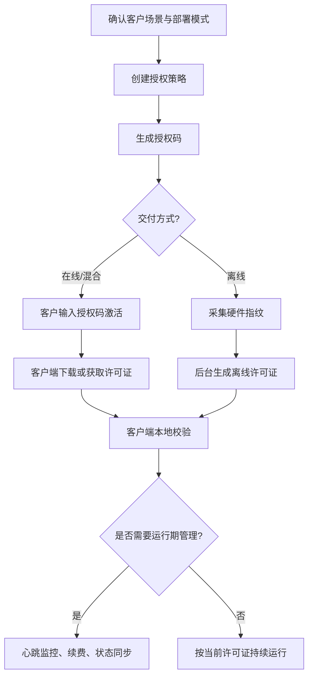

# 操作指南

## 简介

本文面向运营、实施、售后和交付团队，说明如何使用 License Manager 完成**授权创建、授权交付、客户端激活、运行期管理和续费更新**。

如果您已经了解产品定位，可以把这篇文档理解为“日常怎么把授权工作真正跑起来”的操作说明。它不展开客户端代码细节，而是聚焦交付流程、部署模式和常见处理动作。

## 前置理解

在开始之前，建议先区分下面几个核心对象：

- **授权码（License Code）**：用于首次激活或交付的授权标识，通常承载有效期、激活数量、功能范围和部署模式等策略
- **许可证（License File / Key）**：客户端真正用于本地校验的许可证数据，可与设备绑定
- **硬件指纹（Hardware Fingerprint）**：设备标识信息，用于离线授权或设备绑定校验
- **心跳（Heartbeat）**：在线或混合模式下，客户端定期上报的运行状态，用于续期、状态同步和运行期控制

如果您需要了解客户端接入路径，请从 [开发者中心](/developer/) 开始；如果只需要了解许可证结构和客户端校验逻辑，请继续阅读 [许可证结构与验证（客户端要点）](./license-token-structure.md)。

## 先判断使用哪种模式

在实际交付前，建议先根据客户环境选择部署模式。

| 模式 | 适合场景 | 核心特点 | 典型操作 |
|---|---|---|---|
| 在线模式（Cloud） | 客户环境可稳定联网 | 客户端本地校验 + 服务端心跳 | 发授权码、激活、持续续期与状态同步 |
| 离线模式（Standalone） | 内网、工控、隔离环境 | 本地校验，不依赖运行期联网 | 采集硬件指纹、生成许可证、离线交付 |
| 混合模式（Hybrid） | 大多数时间联网，但需要保留一定离线能力 | 平时走在线流程，异常情况下保留短时离线能力 | 发授权码激活 + 心跳管理 + 必要时离线兜底 |

一般可以这样判断：

- 客户环境长期联网，优先选择**在线模式**
- 客户环境完全隔离，选择**离线模式**
- 客户环境通常联网，但不希望短时断网直接影响运行，选择**混合模式**

## 总体操作流程

无论具体模式如何变化，大多数交付都遵循下面这条主流程：

```mermaid
flowchart TD
    A[确认客户场景与部署模式] --> B[创建授权策略]
    B --> C[生成授权码]
    C --> D{交付方式?}
    D -->|在线/混合| E[客户输入授权码激活]
    D -->|离线| F[采集硬件指纹]
    E --> G[客户端下载或获取许可证]
    F --> H[后台生成离线许可证]
    G --> I[客户端本地校验]
    H --> I
    I --> J{是否需要运行期管理?}
    J -->|是| K[心跳监控、续费、状态同步]
    J -->|否| L[按当前许可证持续运行]
```

这条流程可以拆成 5 个阶段：

1. 确认交付模式
2. 创建授权策略并生成授权码
3. 根据模式完成激活或离线交付
4. 客户端使用许可证完成本地校验
5. 对在线或混合模式继续做续费、扩容和状态管理

## 第一步：确认授权策略

在创建授权前，先把策略确认清楚。这样可以减少反复改单和重复交付。

建议至少确认以下信息：

- 这是试用授权还是正式授权
- 有效期如何计算，是固定结束时间还是从激活时开始计算
- 最多允许激活多少台设备
- 需要开放哪些功能模块
- 客户环境适合在线、离线还是混合模式
- 后续是否需要续费、扩容或远程控制

如果是通过社群、论坛、内容平台或发卡平台销售的软件，通常还建议提前考虑：

- 是否需要批量创建授权码
- 是否希望授权有效期从激活时开始计算
- 是否需要让同一个商品对应不同设备数量或不同授权时长

## 第二步：创建授权并完成交付准备

确认策略后，就可以在后台创建授权。

这一步的核心目标是：让“后续交付动作”有一个可追踪、可调整的授权对象。

通常需要完成以下内容：

- 选择对应产品
- 设置授权有效期
- 设置最大激活设备数
- 设置功能范围或功能集
- 选择部署模式
- 生成授权码

如果是批量销售或批量发放场景，可以一次生成一批授权码，统一导出后再交给运营、渠道或第三方发卡平台处理。

:::tip 建议
如果您面对的是标准化商品，而不是逐客户定制交付，建议尽量把授权策略做成少量固定套餐，减少后续维护成本。
:::

## 第三步：按部署模式完成交付

### 在线模式

在线模式适合可稳定联网的客户环境，也是后续最容易做续费和状态管理的一种方式。

基本流程如下：

1. 将授权码交给客户
2. 客户在产品中输入授权码
3. 客户端请求服务端完成激活
4. 客户端获取许可证并保存到本地
5. 客户端启动时基于许可证完成本地校验

在线模式的重点不在于“每次运行都依赖联网”，而在于：

- 首次激活可以通过服务端完成
- 后续可通过心跳获知续费、扩容或状态变化
- 客户端仍然可以基于本地许可证完成核心放行判断

### 离线模式

离线模式适合完全隔离的交付环境，例如工控现场、内网机房或不允许外网访问的客户系统。

基本流程如下：

1. 先获取客户设备的硬件指纹
2. 在后台选择对应授权并录入硬件指纹
3. 生成绑定该设备的离线许可证
4. 将许可证文件交付给客户
5. 客户把许可证放入指定目录或配置位置
6. 客户端启动后在本地完成验证

离线模式的关键点有两个：

- 硬件指纹必须采集准确
- 一旦设备硬件发生变化，通常需要重新生成许可证

:::warning 注意
离线模式下，服务端无法像在线模式那样实时感知设备状态变化。因此建议您提前约定设备更换、重新授权和许可证补发流程。
:::

### 混合模式

混合模式适合大多数时间联网，但又不希望短时断网直接影响业务的软件。

它的交付方式和在线模式相近：

1. 先通过授权码完成激活
2. 客户端获取并保存许可证
3. 正常情况下通过心跳与服务端保持同步
4. 遇到短时断网时，仍基于本地许可证维持运行

这种模式的重点在于平衡两件事：

- 您仍然拥有运行期控制和续费更新能力
- 客户端在短时网络异常下不至于立刻不可用

## 第四步：客户端如何完成激活与本地校验

无论是在线、离线还是混合模式，客户端最终都需要使用许可证做本地校验。

从操作角度看，可以这样理解：

- **在线/混合模式**：客户端通常先拿到授权码，再换取或下载许可证
- **离线模式**：客户端直接加载已交付的许可证文件
- **三种模式的共同点**：客户端最终都要基于许可证完成本地校验

客户端本地校验通常会覆盖以下内容：

- 许可证是否可正常解析
- 签名是否有效
- 授权状态是否正常
- 是否仍处于有效期内
- 是否与当前设备指纹匹配

这部分实现细节请参考：

- [AI 原生 API 快速接入（推荐）](/developer/ai-quickstart.md)
- [许可证结构与验证（客户端要点）](./license-token-structure.md)
- [开发者中心](/developer/)
- [在线激活](/developer/activation-online.md)
- [客户端 SDK（可选）](./sdk.md)

## 第五步：处理续费、扩容和状态变更

### 续费

当客户需要把试用授权转为正式授权，或延长有效期时，常见做法是：

1. 在后台找到对应授权
2. 修改有效期或切换功能范围
3. 保存策略变更
4. 等待客户端下次心跳同步，或通知客户手动刷新

对于在线或混合模式，客户端通常可以在后续通信中获取更新后的许可证或授权状态。

对于离线模式，则通常需要重新导出许可证并交付给客户替换。

### 扩容

如果客户需要增加设备数量或开放更多功能，处理方式与续费类似：

1. 修改最大激活设备数或功能配置
2. 保存变更
3. 让客户端通过心跳同步，或重新交付许可证

扩容前建议先确认当前激活占用情况，避免客户误以为“系统不能激活”，实际上是已有设备名额未释放。

### 锁定或禁用授权

如果需要暂停某个客户的授权使用，可将授权状态调整为锁定。

这类操作常见于：

- 试用到期未续费
- 明显超范围使用
- 需要临时停止某批授权

对于在线或混合模式，这类状态变更通常可以通过后续同步逐步生效。对于离线模式，则需要重新交付新的许可证文件。

## 三个常见业务场景

### 场景 1：7 天试用，后续转正式授权

适合希望先让客户试用，再推动正式成交的场景。

操作建议：

1. 创建试用授权，设置 7 天有效期
2. 将授权码发给客户完成首次激活
3. 观察试用期间的心跳与使用情况
4. 客户确认购买后，在后台延长有效期或切换到正式功能集
5. 让客户端在后续同步中获取新授权状态

### 场景 2：离线环境的单机正式授权

适合内网、工控或不允许联网的客户环境。

操作建议：

1. 创建正式授权并选择离线模式
2. 采集客户目标设备的硬件指纹
3. 生成绑定该设备的许可证
4. 将许可证交付客户并指导其放入指定目录
5. 后续若设备变更，再重新采集指纹并补发许可证

### 场景 3：批量生成授权码，对接发卡平台

适合独立开发者或标准化软件商品销售场景。

操作建议：

1. 提前创建固定的授权套餐
2. 批量生成一组授权码
3. 将授权码导入第三方发卡平台
4. 用户付款后自动获得授权码
5. 用户在软件中输入授权码完成激活

这种模式的价值在于，把销售、发码和激活串成自动化流程，减少人工处理成本。

## 常见问题

### 激活不上去，先看什么

先优先检查以下几项：

- 授权码是否正确
- 当前授权是否已达到最大激活数量
- 客户端是否能访问服务端接口
- 客户端时间是否异常
- 当前产品是否与授权码所属产品一致

### 离线授权为什么经常要重发

最常见原因是设备指纹发生了变化，或者最初采集指纹时不准确。离线模式本身就是围绕“设备绑定”设计的，因此设备变化通常意味着需要重新生成许可证。

### 续费后客户端没有立即生效

可能原因包括：

- 客户端尚未完成下一次心跳或刷新动作
- 客户端仍在使用旧许可证缓存
- 离线模式下尚未替换新许可证文件

### 激活名额明明够，为什么客户还是说不能用

需要区分“激活失败”和“本地校验失败”是不是同一件事。有时授权码已经激活成功，但客户端本地校验因为状态、有效期或设备指纹不匹配而未放行。

## 最佳实践

- 先选模式，再创建授权，不要一边交付一边改策略
- 标准化商品尽量使用固定套餐，减少运营复杂度
- 在线和混合模式尽量保留心跳能力，便于后续续费和状态同步
- 离线交付务必保留硬件指纹采集记录，方便后续补发
- 把“续费怎么生效、设备变更怎么处理、名额怎么释放”提前告知客户

## 相关文档

- [介绍](./index.md)
- [AI 原生 API 快速接入（推荐）](/developer/ai-quickstart.md)
- [开发者中心](/developer/)
- [许可证结构与验证（客户端要点）](./license-token-structure.md)
- [客户端授权测试工具](./client-simulator.md)
- [接口文档](./api.md)
- [客户端 SDK（可选）](./sdk.md)
